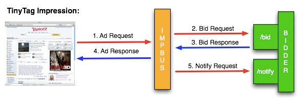

# AppNexus Bidding Protocol

<b>Note:</b>

- **Not Supported**: The AppNexus Bidding
  Protocol is no longer supported; this documentation is for legacy
  purposes only. **This has been deprecated.**
- If you're a new bidder integrating with
  AppNexus, please see the **<a
  href="https://www.iab.com/wp-content/uploads/2016/03/OpenRTB-API-Specification-Version-2-4-FINAL.pdf"
  class="xref" target="_blank">OpenRTB 2.4 Bidding Protocol</a>**.

When you register a bidder instance with the
AppNexus platform, you will be sent a series of
requests by the AppNexus Impression Bus, the key
one being the <a
href="bid-request.md"
class="xref" target="_blank">Bid Request</a>. Your bidder will respond
with a series of responses, the key one being the <a
href="bid-response.md"
class="xref" target="_blank">Bid Response</a>. Below you will find a
list of the requests and responses and brief explanations of the usage
for each. A bidder will need to build "handlers" (i.e. a bid request
handler, a click handler, etc) for each of the services it plans to
support.

## Impression-Specific Request/Response

There are three request/responses used for a standard impression that
passes through the Impression Bus:

- <a
  href="bid-request.md"
  class="xref" target="_blank">Bid Request</a>
- <a
  href="bid-response.md"
  class="xref" target="_blank">Bid Response</a>
- <a
  href="notify-request.md"
  class="xref" target="_blank">Notify Request</a>

**Process**

1.  An ad request (client side) originates from the user's browser on a
    publisher site and requests an ad from the Impression Bus through a
    TinyTag.
2.  The Impression Bus sends a (server side) <a
    href="bid-request.md"
    class="xref" target="_blank">Bid Request</a> to all applicable
    bidders and awaits their responses. Each bidder's user data is
    passed with the Bid Request.
3.  The bidders send a <a
    href="bid-response.md"
    class="xref" target="_blank">Bid Response</a> to the Impression Bus
    within the timeout window (currently 100ms for most sellers, longer
    for some sellers). This will include the javascript code that will
    be used to modify the User Data in the event that that bidder wins
    the auction.
4.  The Impression Bus determines the highest paying bid, and returns
    the associated creative to the user's browser.
5.  A <a
    href="notify-request.md"
    class="xref" target="_blank">Notify Request</a> is sent to all
    applicable bidders, including bidders that did not send in a Bid
    Response, to detail the results of the auction.

<b>Note:</b> This process is slightly
different for auctions in which the results are passed to a secondary
exchange.

## Other Request/Responses

**Bidder Ready Request**

Every bidder instance (see <a
href="bidder-instance-service.md"
class="xref" target="_blank">Bidder Instance Service</a>) is required to
have a working service that responds to a <a
href="ready-request.md"
class="xref" target="_blank">Ready Request</a>. This allows the
Impression Bus know in real time what instances it should send traffic
to.

**Bidder Click Request**

A bidder may (optionally) build a click handler for the <a
href="click-request.md"
class="xref" target="_blank">Click Request</a>. This is only needed if
your bidder's members choose to use click tracking through the
Impression Bus. If all of a member's creatives are third-party (e.g.
DART or Atlas) tags, and they choose to use the third party solely for
click tracking purposes, your bidder may not need to support this
request type.

**Mobile OpenRTB for Bidders**

Mobile demand partners can integrate with
AppNexus using the OpenRTB API specification.
For more information, see <a
href="supply-partners/openrtb-specs.md"
class="xref" target="_blank">Mobile OpenRTB Integration</a>.

