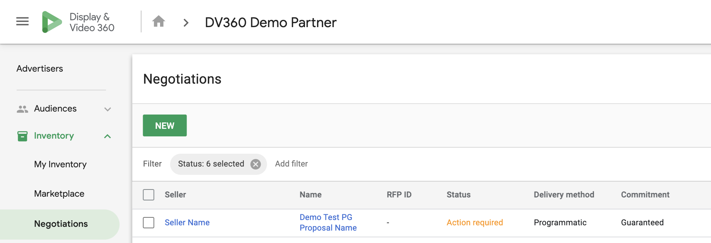

# DV360 Buyer UI Deal Acceptance Workflows

<b>Note:</b>

This product is currently in Beta stage and has been enabled for
selected sellers who have chosen to participate in the beta testing. If
you would like to test out this product, please reach out to your
Xandr account representative.

##  Overview

Once a seller's deal is successfully uploaded to the Display & Video 360
(DV360) systems, buyers should follow the below steps to accept the deal
and start bidding on it.

## Accept Deals

1.  The deals that can be accepted will be listed
    under Negotiations as shown
    below. You need to look for the status “**Action required**” for the
    deal.  
      
    
    
    
2.  Click on the name of the proposed deal and click "ACCEPT" to
    finalize the proposed deal.
3.  Configure the deal using the appropriate process explained below.

**Configure non-PG Deals**

1.  To configure your deal,
    select Inventory
     \>  My
    Inventory from the left menu. 
2.  Assign the non-PG deal to the line items. The following steps
    describe assigning the deal to existing and new line items.  
      

**To assign non-guaranteed inventory to existing line items:**

1.  Locate the deal in the Action
    Required section and select
    Action
     \>  Assign to existing line
    item.
2.  In the menu that appears on the right select the following:
    - Advertiser
    - Campaign
    - Insertion order
    - Line item(s)
3.  Click Assign when you are done.

**To assign non-guaranteed inventory to new line items:**

1.  Locate the deal in the Action
    Required section and
    select Action
     \>  Assign to new line
    item.
2.  In the following page, enter the below information for your line
    item:
    - Name for your line item. Additionally, you can create your line
      item as a "**Draft**" if you don't want it to be immediately
      eligible to serve once you've saved it here. If you do want it to
      serve as soon as its start date has occurred, create the line item
      as "**Active**".
    - Your line
      item's <a href="https://support.google.com/displayvideo/answer/2949929"
      class="xref" target="_blank">targeting</a>.
    - Your line item's flight dates. For display and video line items,
      you can
      use <a href="https://support.google.com/displayvideo/answer/9265340"
      class="xref" target="_blank">real-time triggers</a> to control
      your line item's flight.  
    - Your Budget and Pacing settings. DV360 can automatically adjust
      your line item's budget if you've turned
      on <a href="https://support.google.com/displayvideo/answer/2956568"
      class="xref" target="_blank">automatic budget allocation</a> for
      the line item's insertion order.  
    - Your <a href="https://support.google.com/displayvideo/answer/2997422"
      class="xref" target="_blank">bid strategy</a>.  
    - The line item's frequency cap.  
    - The creatives you want to use with this line item. A line item
      won't be able to serve until one or more creatives assigned to the
      line item is approved.  
    - Your method for conversion tracking.  
3.  Click Assign when you are done.

<b>Note:</b>

Learn more about how to manage your non-PG deals in the <a
href="https://support.google.com/displayvideo/answer/6224774?hl=en&amp;ref_topic=6224744"
class="xref" target="_blank">DV360 help page</a>.

**Configure PG Deals**

1.  To configure your deal,
    select Inventory
     \>  My
    Inventory from the left menu. Locate the deal in the
    Action Required section and
    select Action
     \>  Configure on
    the right.
2.  Review the deal details section and make sure the order and product
    details are correct. If not, please reach out to the publisher to
    update.
3.  Select whether only partner users or both partner and default
    advertiser users can edit and configure this deal.
4.  Next, choose which advertisers have permission to target the
    products. Optionally, you can toggle
    "Assign inventory source to all
    advertisers" to allow any advertiser permission to target the
    products. When you are done, choose the default advertiser. This
    advertiser will use the guaranteed inventory unless specified
    otherwise. 
5.  Select a campaign. Note that only a campaign under the default
    advertiser can be selected.
6.  The next step is to select at least one available creative for each
    of the product sizes and durations specified in the deal. Note that
    only creatives that meet the creative requirements and that are from
    your selected advertisers will be available.

<b>Note:</b>

Learn more about how to manage your PG deals in the <a
href="https://support.google.com/displayvideo/answer/7067656?hl=en#configuring"
class="xref" target="_blank">DV360 help page</a>.

