# Trade Desk Buying Guide

## Overview

Xandr, in partnership with Trade Desk, has
created this buying guide to help
Xandr publishers communicate with their buyers
about accessing and targeting Xandr's publisher
inventory using Trade Desk as their DSP. The information has been
created in collaboration with and approved by the Trade Desk team.
Please note that platforms can and will change regularly, and as always
with our documentation we will do our best to update this guide as
needed. Wherever possible we've provided links to Trade Desk
documentation, and we recommend that if buyers are having issues or need
help with using the Trade Desk platform their first point of outreach
should be the Trade Desk team.

## Key Definitions

<table class="table">
<thead class="thead">
<tr class="header row">
<th id="ID-00000c3a__entry__1"
class="entry colsep-1 rowsep-1">Terminology</th>
<th id="ID-00000c3a__entry__2"
class="entry colsep-1 rowsep-1">Definitions</th>
</tr>
</thead>
<tbody class="tbody">
<tr class="odd row">
<td class="entry colsep-1 rowsep-1"
headers="ID-00000c3a__entry__1">Publisher Management Platform (PMP)</td>
<td class="entry colsep-1 rowsep-1" headers="ID-00000c3a__entry__2"><ul>
<li>Displays the essential information about buyers’ private
contracts.</li>
<li>Navigate to the PMP dashboard by clicking Libraries in the platform header and
selecting Publisher Management Platform
(PMP).</li>
</ul></td>
</tr>
<tr class="even row">
<td class="entry colsep-1 rowsep-1"
headers="ID-00000c3a__entry__1">Campaign</td>
<td class="entry colsep-1 rowsep-1" headers="ID-00000c3a__entry__2"><ul>
<li>Strategy for purchasing advertising inventory that is organized
around a theme, product, or brand.</li>
<li>Run for a set period of time (flight) and are given individual
budgets with which to purchase inventory.</li>
<li>The Campaign level is located under an Advertiser and above its
corresponding Ad Groups.</li>
</ul></td>
</tr>
<tr class="odd row">
<td class="entry colsep-1 rowsep-1" headers="ID-00000c3a__entry__1">Ad
Group</td>
<td class="entry colsep-1 rowsep-1"
headers="ID-00000c3a__entry__2">Belongs to a campaign, which belongs to
an advertiser. This is where buyers start constructing the details and
targeting for the strategy they are running.</td>
</tr>
<tr class="even row">
<td class="entry colsep-1 rowsep-1"
headers="ID-00000c3a__entry__1">Inventory Contracts</td>
<td class="entry colsep-1 rowsep-1" headers="ID-00000c3a__entry__2"><ul>
<li>First-Party Inventory Contracts: Established by a partner of The
Trade Desk. Buyer contacts their account manager for assistance creating
a first-party contract.</li>
<li>Third-Party Inventory Contracts: Managed by The Trade Desk and
available for all partners to use (“always-on” deals).</li>
</ul></td>
</tr>
<tr class="odd row">
<td class="entry colsep-1 rowsep-1"
headers="ID-00000c3a__entry__1">Programmatic Guaranteed (PG)</td>
<td class="entry colsep-1 rowsep-1" headers="ID-00000c3a__entry__2"><ul>
<li>A publisher reserves inventory for the buyer, and in turn, the buyer
commits a certain amount of spend to the publisher.</li>
<li>Fixed CPM</li>
<li>The Trade Desk bids at a rate of ~96%+ and should win all the bids
it presents.</li>
<li>The supply-side partner (SSP)/publisher is expected to be able to
pace the deal ID evenly over the course of the specified flight.</li>
</ul></td>
</tr>
</tbody>
</table>

## Trade Desk’s Deal Workflow

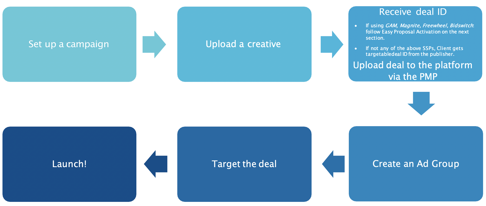

## Easy Proposal Activation - For GAM, Magnite, Freewheel, Bidswitch

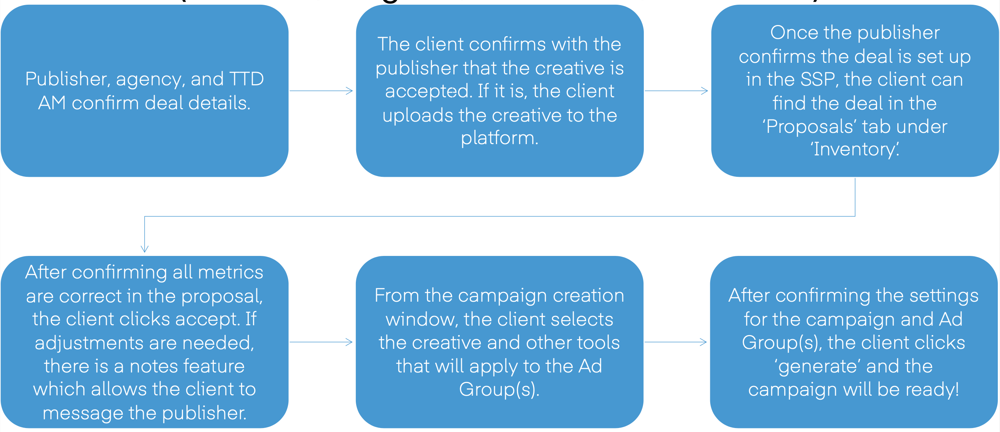

## Deal Workflow

**Step 1: Set Up a Campaign**

- Initiate the setting up of a campaign by clicking
  +CAMPAIGN button and enter the
  Campaign Name.
  
  

**Step 2: Upload a Creative**

- Upload hosted and third party creatives within the
  Add Creative wizard in
  the Basic Information page.
  Creatives for all media types are uploaded here. Note that native
  creatives must be hosted to proceed further. Below screenshots depicts
  the uploading of a hosted display creative.
  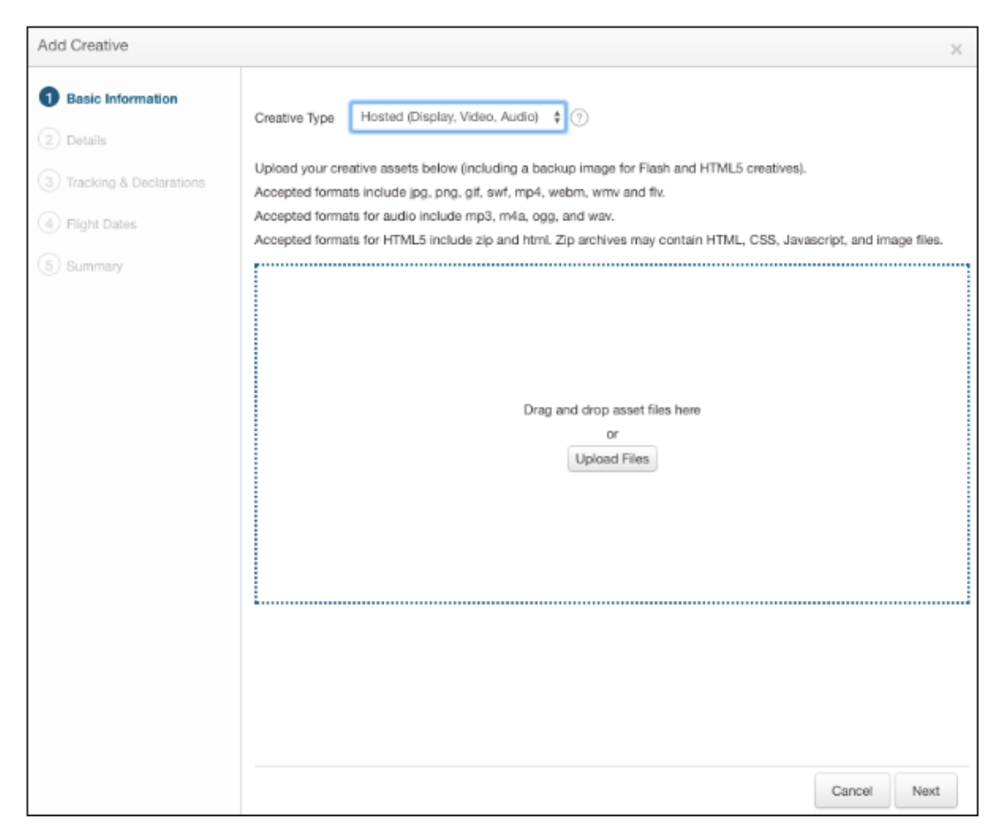
 

<!-- -->

- Next, in the Details page, enter
  the Name and the
  Landing Page URL for your creative.
  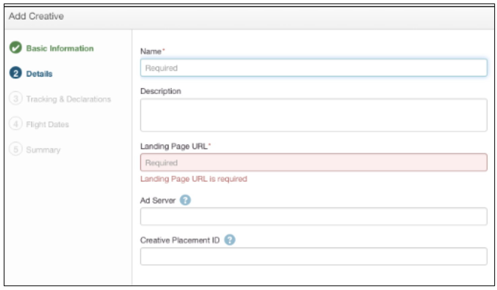
 

<!-- -->

- Next, in Tracking and
  Declarations page, enter the necessary details as per of your
  requirements.
  

  <b>Note:</b> The
  Clickthrough URL field is mandatory
  in this page.

  
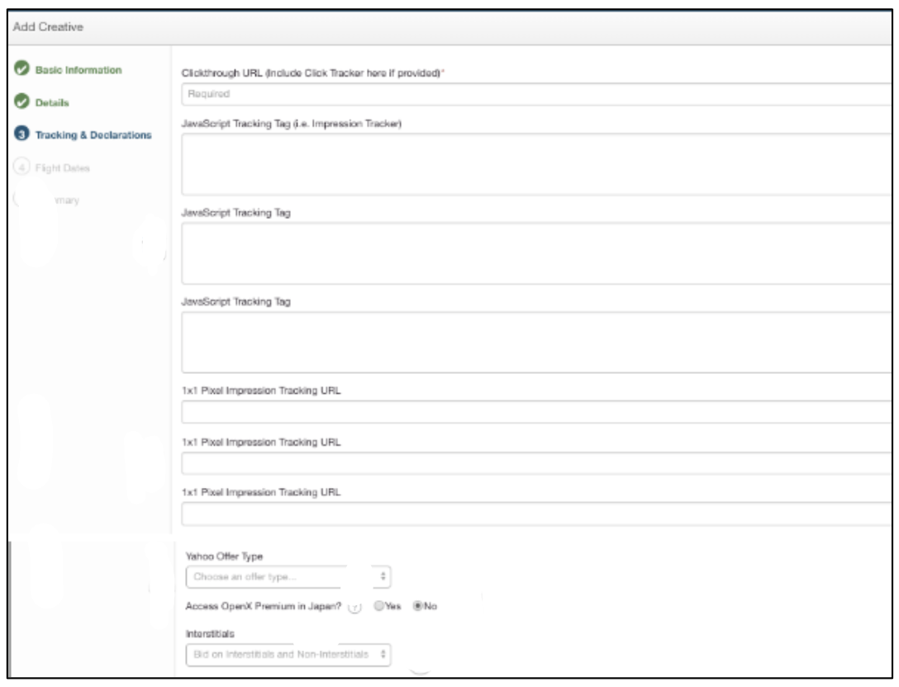
  

<!-- -->

- Next, in Flight Dates page,
  enter the start and end date of the creative flight along with the
  Time Zone.
  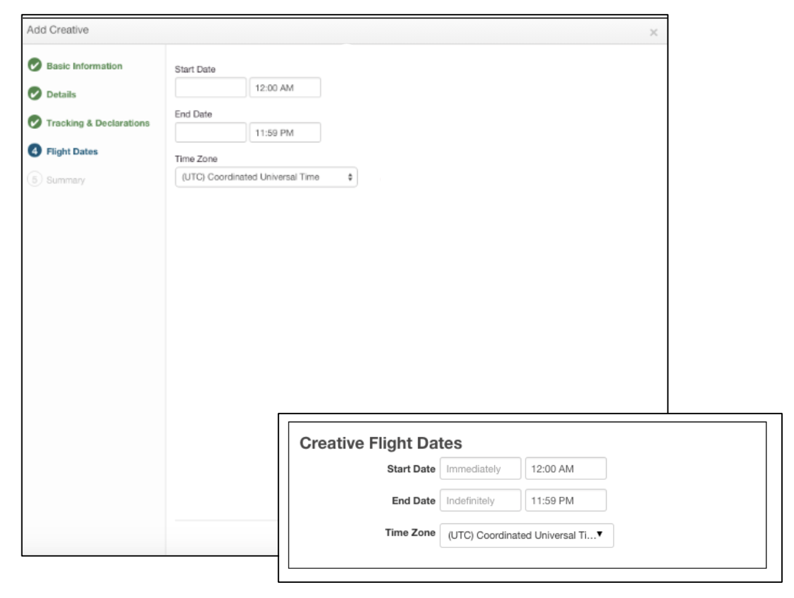
  

<!-- -->

- Next, in the Summary page, review the information entered and confirm
  the details.

**Step 3: Upload a Deal to the Trade Desk Platform via PMP**

- Click Inventory Contract to open the
  Inventory Contract Wizard. In
  Description page, enter the
  Name of the contract. Other details
  in the page is optional.
  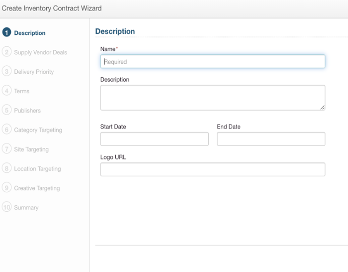

<!-- -->

- In Supply Vendor Deals page,
  select the Supply Vendor and enter
  Deal
  Code/ID as well as CPM.
  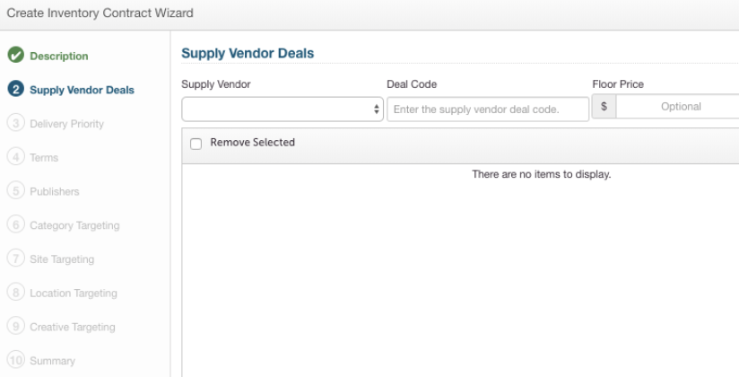
 

<!-- -->

- In Publishers page, add the
  Publisher Name associated with the
  **Deal ID** and click Next.
  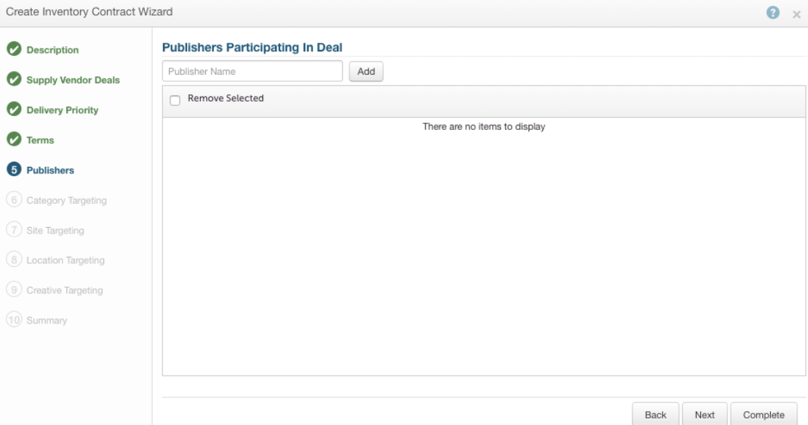
  
<!-- -->

- In Category Targeting, Site
  Targeting and Location
  Targeting pages, specify applicable category(s), site(s), and
  location(s) that you want to target and
  click Next.
  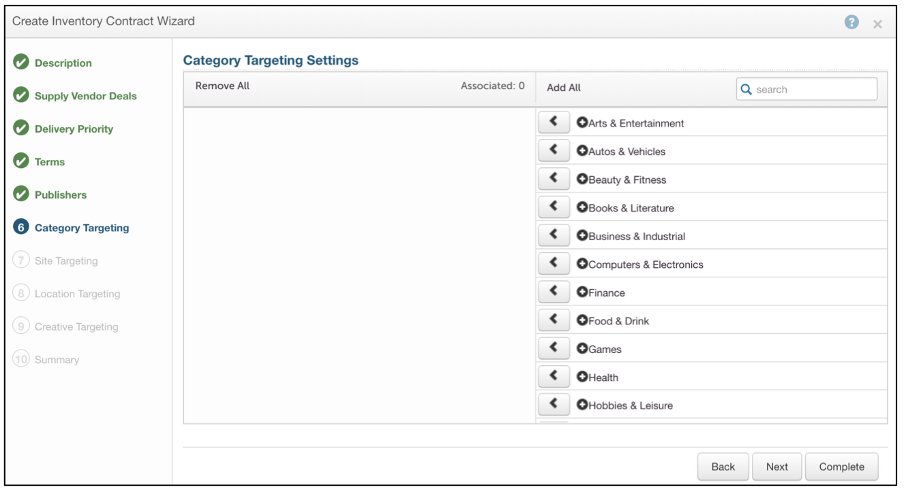
 

<!-- -->

- In Creative Targeting page,
  select the applicable Ad Sizes and
  click Complete. Once you click
  Complete, you will only see
  available impressions for the deal as long as the deal is activated in
  the SSP.
  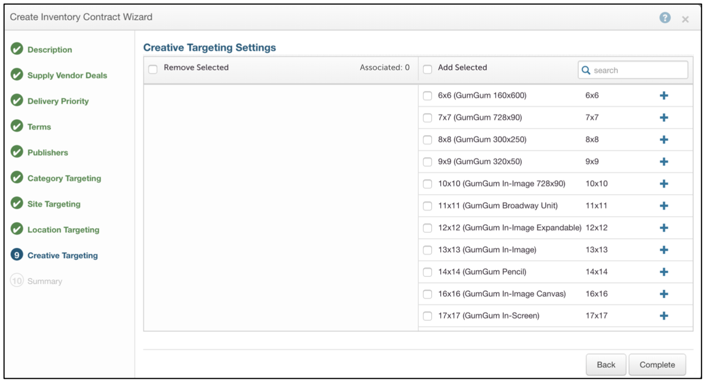
  

**Step 4: Create an Real Time Bidding (RTB) Ad Group**

- Click the +Ad Group button and enter
  a name to your Ad Group. It is recommended to choose a unique name
  which differs from your other Ad Groups. Select the
  Media Types,
  Device Types,
  Ad Environments and specify
  the Goal and
  Target in the page. Click
  Next.
  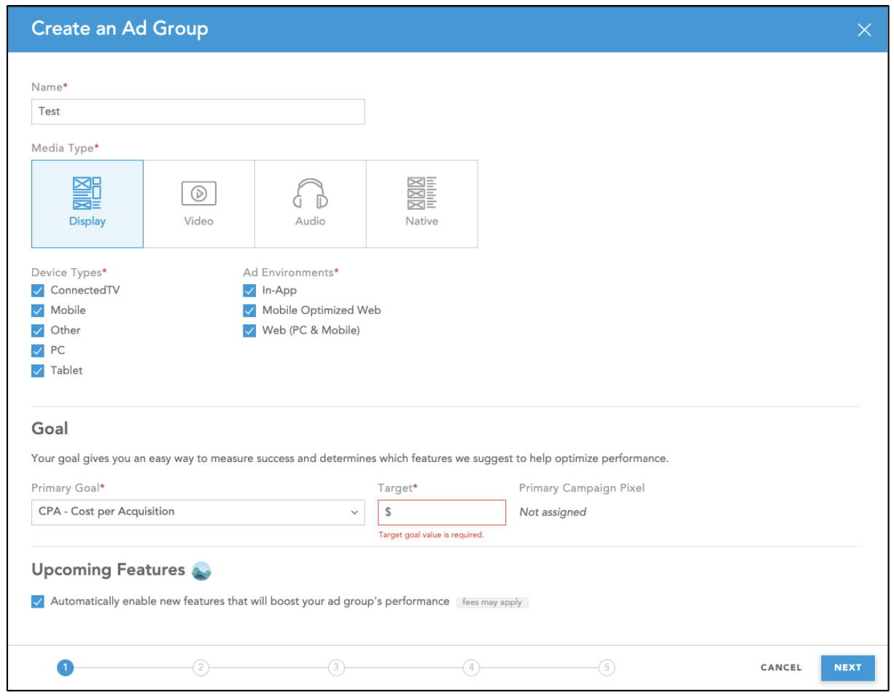

<!-- -->

- Select your Pacing and
  Flight Dates and specify your budget
  for the flights. Enter the amount for your
  Base bid and
  Max bid and click
  Next.
  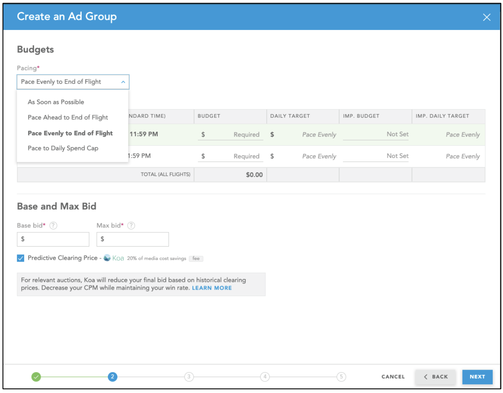
  

<!-- -->

- Select your Audience Type,
  Frequency, and
  Geos for targeting. Next, enable
  Cross-Device targeting and
  attribution.
  
  

<!-- -->

- Complete your Ad Group creation set up by selecting
  Creatives from drop-down, adding
  Sites/App lists using
  ADD LIST button, and selecting the
  Market type under the
  Private Contract section that you
  uploaded previously.
  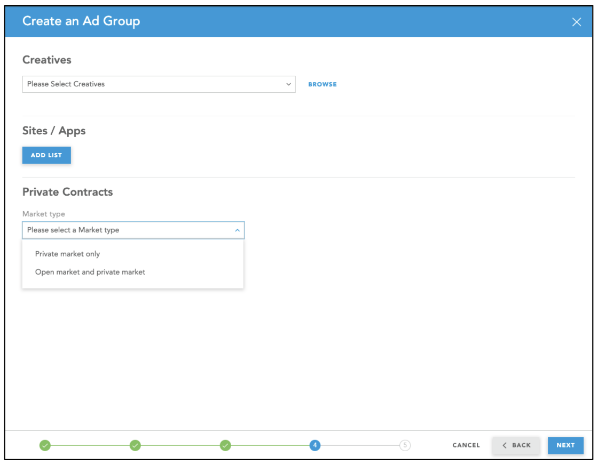
  

<b>Note:</b> Below is the list of targeting
options available when creating an Ad Group:

- Language
- Site and SSP
- Device Types
- Browser/OS
- Time and Day of Week
- Video Size and Quality
- Device Make and Model
- Ad Format and Ad Size
- Viewability/Fold
- Geography/ Latitude & Longitude
- Frequency
- Mobile Carrier

**Step 5: Target and Launch the Deal**

- Find the deal by searching by deal ID or deal name. Once fetched,
  target the deal ID within the Private
  Contract rail at the Ad Group level. Note that, it is possible
  to target more than one private contract in a single Ad Group. Once
  the deal is trafficked in the SSP, your Ad Group will automatically
  start spending according to the requirements.
  
 

## Programatic Guaranteed (PG) Workflow

## Tips & Tricks for PG Workflow

- For PG deals with **GAM**, **Magnite**, **Freewheel**, or
  Bidswitch, the client will utilize
  the Easy Proposal Activation workflow described above.
- If the SSP is not **GAM**, **Magnite**, **Freewheel**, or
  Bidswitch, the publisher will
  provide the client with the targetable deal ID so the client can
  create the PG contract in The Trade Desk platform.

<b>Note:</b>

A few best practices for clients:

- Make sure to leverage the The Trade Desk’s PG workflow on the
  platform.
- Ensure that there are no daily spend caps on the Ad Group or Campaign
  level.
- Confirm that the Ad Groups are in active state.
- Make sure that the agreed ad sizes are trafficked at the Ad Group
  level.
- Make it certain that all parties are aligned on the budget. Ensure
  that the client’s creative meets the specs outline by the publisher
  and that the creative is uploaded 24-48 hours before the launch date.

## Deal Troubleshooting Tips & FAQs

**First Party 1:1 Deal Troubleshooting Guide**

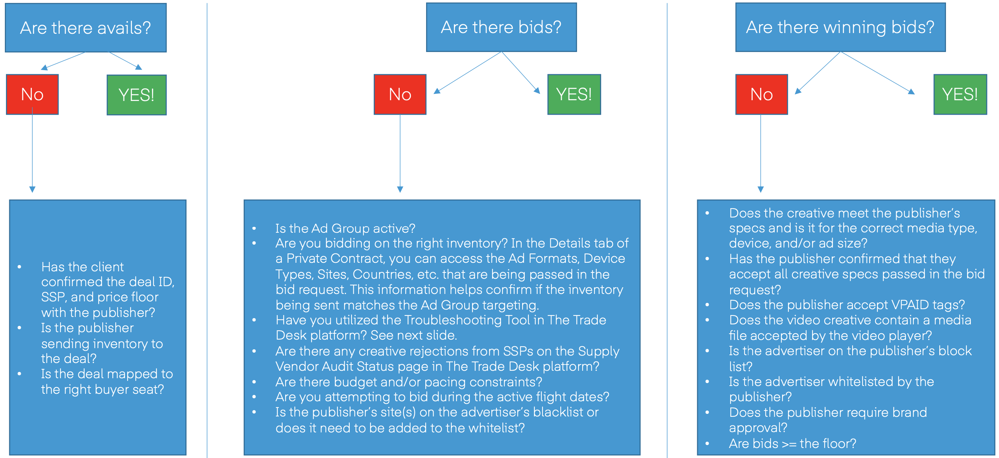

- Go into the Private Contract
  rail in your Ad Group and click
  Troubleshoot to see the
  ISSUE,
  DETAILS,
  POTENTIAL SOLUTION, and
  EXCLUDED PERCENTAGE of bids for
  a specific contract.
  
 
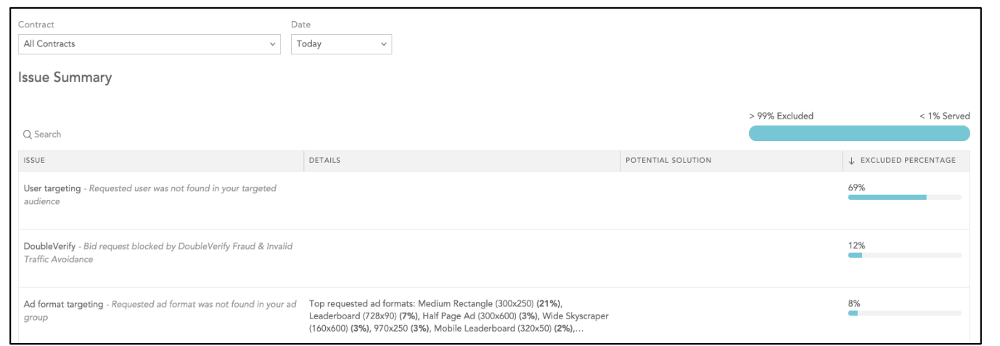

- The Bid Exclusions Reasons
  dialog would appear. You can
  <table id="ID-00000c3a__table_n3t_b4r_qwb" class="table">
  <tbody class="tbody">
  <tr class="odd row">
  <td class="entry colsep-1 rowsep-1">Contract Dropdown</td>
  <td class="entry colsep-1 rowsep-1">Switch between contracts assigned to
  your Ad Group by selecting a different name from this dropdown. Select
  All Contracts to see reasons across all deals in your Ad Group.</td>
  </tr>
  <tr class="even row">
  <td class="entry colsep-1 rowsep-1">Deal</td>
  <td class="entry colsep-1 rowsep-1">Select a specific deal for the
  contract in question or choose All to
  see issues from all deals associated with the contract.</td>
  </tr>
  <tr class="odd row">
  <td class="entry colsep-1 rowsep-1">Date</td>
  <td class="entry colsep-1 rowsep-1">Select a date range to filter
  issues.</td>
  </tr>
  <tr class="even row">
  <td class="entry colsep-1 rowsep-1">View Contract Details</td>
  <td class="entry colsep-1 rowsep-1">Click this link to be taken to the
  Settings page for the contract in question.</td>
  </tr>
  <tr class="odd row">
  <td class="entry colsep-1 rowsep-1">Percentage Indicator</td>
  <td class="entry colsep-1 rowsep-1">Use this bar to compare the
  percentage of bids excluded to the percentage of bid served.</td>
  </tr>
  </tbody>
  </table>

**Common Reasons for Bid Exclusions and their troubleshooting**

<table id="ID-00000c3a__table_q3t_b4r_qwb" class="table">
<thead class="thead">
<tr class="header row">
<th id="ID-00000c3a__table_q3t_b4r_qwb__entry__1"
class="entry colsep-1 rowsep-1">Common Reason for Bid Exclusion</th>
<th id="ID-00000c3a__table_q3t_b4r_qwb__entry__2"
class="entry colsep-1 rowsep-1">The Trade Desk Definition</th>
<th id="ID-00000c3a__table_q3t_b4r_qwb__entry__3"
class="entry colsep-1 rowsep-1">The Trade Desk Suggestion</th>
</tr>
</thead>
<tbody class="tbody">
<tr class="odd row">
<td class="entry colsep-1 rowsep-1"
headers="ID-00000c3a__table_q3t_b4r_qwb__entry__1">Creative Not
Eligible</td>
<td class="entry colsep-1 rowsep-1"
headers="ID-00000c3a__table_q3t_b4r_qwb__entry__2">An issue with the
creative’s approval status, attributes, or settings prevented a bid
response from being served.</td>
<td class="entry colsep-1 rowsep-1"
headers="ID-00000c3a__table_q3t_b4r_qwb__entry__3">Check if the creative
is being blocked on the publisher’s end due to category or block
advertiser restrictions. Have the publisher check with the supply vendor
that the creative ID isn’t being excluded from the auction and has been
approved by the supply vendor. Confirm that the necessary media types
are included in the creative.</td>
</tr>
<tr class="even row">
<td class="entry colsep-1 rowsep-1"
headers="ID-00000c3a__table_q3t_b4r_qwb__entry__1">No Creatives of
Correct Type Found</td>
<td class="entry colsep-1 rowsep-1"
headers="ID-00000c3a__table_q3t_b4r_qwb__entry__2">The Ad Group has no
creatives of the correct type (display, video, native, audio) matching
the bid request.</td>
<td class="entry colsep-1 rowsep-1"
headers="ID-00000c3a__table_q3t_b4r_qwb__entry__3">Ensure the creatives
assigned to your Ad Group match the creative types coming through the
contract details. For example, if you have video creatives assigned to
your Ad Group, confirm that video inventory is coming through the deal
and if the publisher accepts VAST or VPAID.</td>
</tr>
<tr class="odd row">
<td class="entry colsep-1 rowsep-1"
headers="ID-00000c3a__table_q3t_b4r_qwb__entry__1">No Matching Ad Format
Found</td>
<td class="entry colsep-1 rowsep-1"
headers="ID-00000c3a__table_q3t_b4r_qwb__entry__2">The Ad Group does not
have a creative assigned with an ad format matching the bid
request.</td>
<td class="entry colsep-1 rowsep-1"
headers="ID-00000c3a__table_q3t_b4r_qwb__entry__3">Make sure that all
creatives assigned to your Ad Group match the creative sizes coming
through the contract details. For example, if the publisher is sending
970x250 and 728x90 desktop display inventory, ensure that you have
970x250 and 728x90 creatives assigned to your Ad Group.</td>
</tr>
<tr class="even row">
<td class="entry colsep-1 rowsep-1"
headers="ID-00000c3a__table_q3t_b4r_qwb__entry__1">Referrer Data
Missing</td>
<td class="entry colsep-1 rowsep-1"
headers="ID-00000c3a__table_q3t_b4r_qwb__entry__2">A pre-bid solution
such as DoubleVerify, Grapeshot, IAS or Peer39 blocked the request.</td>
<td class="entry colsep-1 rowsep-1"
headers="ID-00000c3a__table_q3t_b4r_qwb__entry__3">Consider loosening or
lifting pre-bid solutions as they may be restricting the number of
requests.</td>
</tr>
<tr class="odd row">
<td class="entry colsep-1 rowsep-1"
headers="ID-00000c3a__table_q3t_b4r_qwb__entry__1">User Doesn’t Match
Audience Targeting</td>
<td class="entry colsep-1 rowsep-1"
headers="ID-00000c3a__table_q3t_b4r_qwb__entry__2">The Ad Group is
targeting an audience and there was no match found with the bid
request.</td>
<td class="entry colsep-1 rowsep-1"
headers="ID-00000c3a__table_q3t_b4r_qwb__entry__3">Confirm with the
publisher the avails for the audience in which you’re targeting.
Consider expanding the audience targeting so scale is not limited.</td>
</tr>
</tbody>
</table>

**Common Questions asked while Troubleshooting**

<table id="ID-00000c3a__table_r3t_b4r_qwb" class="table">
<thead class="thead">
<tr class="header row">
<th id="ID-00000c3a__table_r3t_b4r_qwb__entry__1"
class="entry colsep-1 rowsep-1">Questions</th>
<th id="ID-00000c3a__table_r3t_b4r_qwb__entry__2"
class="entry colsep-1 rowsep-1">Response</th>
</tr>
</thead>
<tbody class="tbody">
<tr class="odd row">
<td class="entry colsep-1 rowsep-1"
headers="ID-00000c3a__table_r3t_b4r_qwb__entry__1">Is the advertiser’s
audience targeting too specific and therefore restricting bidding?</td>
<td class="entry colsep-1 rowsep-1"
headers="ID-00000c3a__table_r3t_b4r_qwb__entry__2">Remaining Addressable
Market (RAM) shows how many imps are available to bid on after the Ad
Group’s targets and rails have been applied. The lower the score, the
more restrictive; the higher the score, the less restrictive. Common
Targeting Parameters: Audience, Geo, Brand Safety &amp; Measurement,
Device.</td>
</tr>
<tr class="even row">
<td class="entry colsep-1 rowsep-1"
headers="ID-00000c3a__table_r3t_b4r_qwb__entry__1">Did the publisher
increase the deal floor and you are now bidding below the floor?</td>
<td class="entry colsep-1 rowsep-1"
headers="ID-00000c3a__table_r3t_b4r_qwb__entry__2">Confirm the floor
price listed in the deal.</td>
</tr>
<tr class="odd row">
<td class="entry colsep-1 rowsep-1"
headers="ID-00000c3a__table_r3t_b4r_qwb__entry__1">Did the publisher
shift the inventory to a different SSP?</td>
<td class="entry colsep-1 rowsep-1"
headers="ID-00000c3a__table_r3t_b4r_qwb__entry__2">Check if you are
seeing avails come through the deal. If it’s a First Party 1:1 deal,
reach out to the publisher directly; if it’s a Third Party PMP Library
deal, reach out to your Account Manager.</td>
</tr>
<tr class="even row">
<td class="entry colsep-1 rowsep-1"
headers="ID-00000c3a__table_r3t_b4r_qwb__entry__1">Is there an issue if
avails, and winning bids, are coming through a Third Party PMP Library
deal ID but there’s not much spend? 
</td>
<td class="entry colsep-1 rowsep-1"
headers="ID-00000c3a__table_r3t_b4r_qwb__entry__2"><ul>
<li>Our buyers are self-service and will make the decision as to when/if
they activate their campaigns against certain supply types.</li>
<li>We encourage the publishers’ sales team to share the deal private
contract links with any clients you are contacting. The link will drive
buyers with logins to our platform closer to the point of spend
activation on the Third Party PMP Library deals. Please note that you
will not be able to view the links, but our clients should have
access.</li>
<li>You may see more adoption in client First Party 1:1 deals after
setting up Third Party PMP Library deals. The 1:1 deals will likely
drive more revenue, but we see value in the PMP Library deals since they
allow newer and smaller agencies to access your inventory.</li>
</ul></td>
</tr>
</tbody>
</table>

<b>Note:</b>

The above troubleshooting steps are general in nature. Your Account
Manager and The Trade Desk Knowledge Portal are the best resources for
assistance with PMP deals and the Trade Desk platform.

