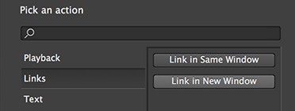

# Build an HTML5 Xandr Creative in Adobe Edge


This guide explains how to use Adobe Edge to build HTML5 creatives that
will properly track clicks in Xandr. It assumes
that you are familiar using Adobe Edge to build creatives.


## With Xandr HTML5 Library


1.  From within Adobe Edge, select the element you want to
    make clickable from the
    Elements panel. (Naming the
    element "clickable" is not required)

    
2.  Open **Actions** for the selected element. The Actions panel will
    pop-up with a dropdown menu. Then select **click** in the dropdown
    menu.

   

3.  Select Links and **Link in New
    Window** from the Pick an
    Action area.

    

4.  You will see code that looks like this.

   

5.  Replace the “<a href="http://www.adobe.com" class="xref"
    target="_blank">https://www.adobe.com</a>” with
    **`APPNEXUS.getClickTag()`**. Make sure to remove the quotations.

    

6.  From the Library panel, in the
    Scripts drop-down, click
    Add JS File from URL... Paste <a
    href="https://acdn.adnxs.com/html5-lib/1.3.0/appnexus-html5-lib.min.js"
    class="xref" target="_blank">https://acdn.<span
    class="ph">adnxs.com/html5-lib/1.3.0/<span
    class="ph">appnexus-html5-lib.min.js</a> into the field and
    click OK.

    

    

    

    <b>Tip:</b> Use https to ensure the
    creative can serve on secure inventory.

    

    

7.  Click Preview in Browser to open
    the ad in your browser. Add `?clickTag=http://YOUR-URL-HERE.com` at
    the end of the URL in the address bar with the landing page you want
    to test. Refresh the page and click on the ad. A new window with the
    landing page you entered should open in your browser. When the
    creative is served, Xandr sets the value of
    `clickTag` to Xandr's click tracker and sets
    a redirect to the landing page URL provided in Console.


## Without Xandr HTML5 Library


1.  From within Adobe Edge, select the element you want to make
    clickable from the **Elements** panel. (Naming the element
    "clickable" is not required).

    

2.  Open **Actions** for the selected element. The **Actions** panel
    will pop-up with a dropdown menu. Then select **click** in the
    dropdown menu.

    

3.  Paste the code below into the text box provided (this is your
    `clickTag` code).

    

    ``` pre
    function getParameterByName(name) {
      var match = RegExp('[?&]' + name + '=([^&]*)').exec(window.location.search);
      return match && decodeURIComponent(match[1].replace(/\+/g, ' '));
    }
    window.open(getParameterByName('clickTag'), '_blank');
    ```

    

    

4.  Click Preview in Browser to open
    the ad in your browser. Add `?clickTag=http://YOUR-URL-HERE.com` at
    the end of the URL in the address bar with the landing page you want
    to test. Refresh the page and click on the creative. A new window
    with the landing page you entered should open in your browser. When
    the creative is served, Xandr sets the value
    of `clickTag` to Xandr's click tracker and
    sets a redirect to the landing page URL provided in Console.


## Related Topics


- <a
  href="build-an-html5-xandr-creative-in-google-web-designer.md"
  class="xref" target="_blank">Build an HTML5 Xandr Creative in Google Web
  Designer</a>


**Related information**  

- <a href="build-an-html5-xandr-creative-in-google-web-designer.md"
  class="link">Build an HTML5 Xandr Creative in Google Web Designer  </a>


