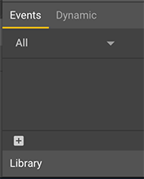
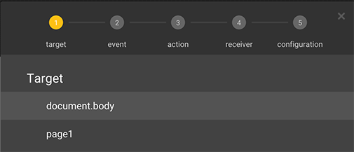
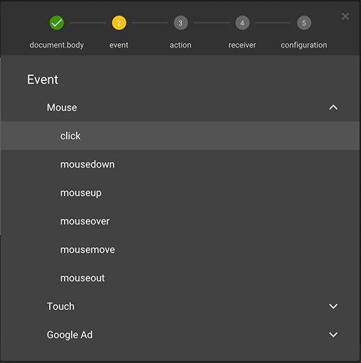
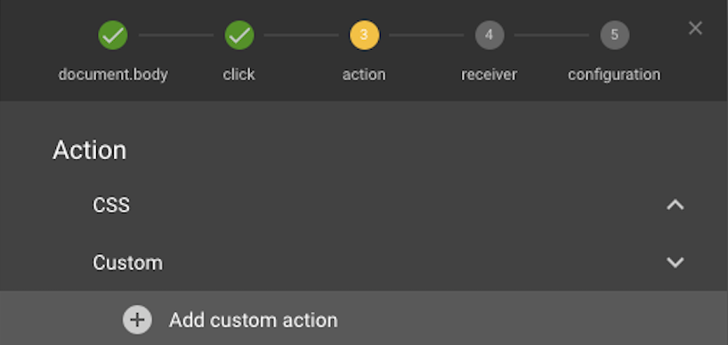
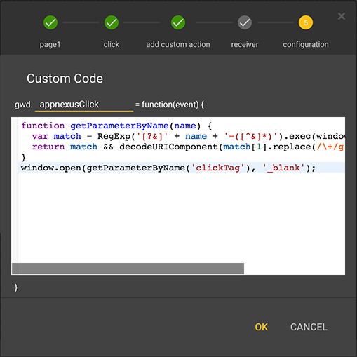
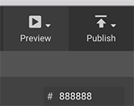

# Build an HTML5 Xandr Creative in Google Web Designer  


This page explains how to use Google Web Designer to build HTML5
creatives that will properly track clicks in
Xandr.


1.  Open Google Web Designer.

2.  Click CREATE NEW FILE. The *Create
    New Blank File* pop-up displays.

3.  Click HTML from the
    Others menu.

4.  Enter a Name and
    Title for the creative.

5.  Select a Location and
    Animation Mode.

6.  Click OK. The *Create New Blank
    File* pop-up closes.

7.  Click the + button in the lower
    left of Google Web Designer under
    the Events tab to add a new
    event.

   

       
      
    A pop-up displays.

8.  Select a target.  

    

    This will be the element of the ad that will be clickable.  

9.  Select an event.

10. Select one of the available options that display for the event.  

 

11. Select Custom under
    the action menu.

12. Select Add custom action.  

   

13. Type a unique name in the text field that displays next to
    "*gwd*." (e.g., *XandrClick*).

14. Paste the code below into the text box provided (this is
    your `clickTag` code).

    ``` pre
    function getParameterByName(name) {
      var match = RegExp('[?&]' + name + '=([^&]*)').exec(window.location.search);
      return match && decodeURIComponent(match[1].replace(/\+/g, ' '));
    }
    window.open(getParameterByName('clickTag'), '_blank');
    ```

  
    
    
    <b>Note:</b>
    <p>Since Google Web Designer has a <a
    href="http://stackoverflow.com/questions/30221826/how-do-you-copy-paste-html-code-in-google-web-designer"
    class="xref" target="_blank">known issue</a> related to key commands,
    you must paste the code using your computer's menu bar paste option.</p>
    
    
    </figure>

15. Click OK.

16. Test the creative by performing the following if necessary:
    1.  Click  Preview in the upper
        right of Google Web Designer to open the creative in your
        browser.   

       

    2.  Add
        "`?clickTag=`<a href="http://yoururlhere.com/" class="xref" target="_blank"><code
        class="ph codeph">https://yoururlhere.com</code></a>" in the
        address bar at the end of the landing page URL that you want to
        test.

    3.  Refresh the page and click on the creative.   

        A new window with the landing page that you entered should open
        in your browser. When the creative is served,
        Xandr sets a value of `clickTag` to
        Xandr' click tracker along with a
        redirect to the landing page URL provided in the Console.


