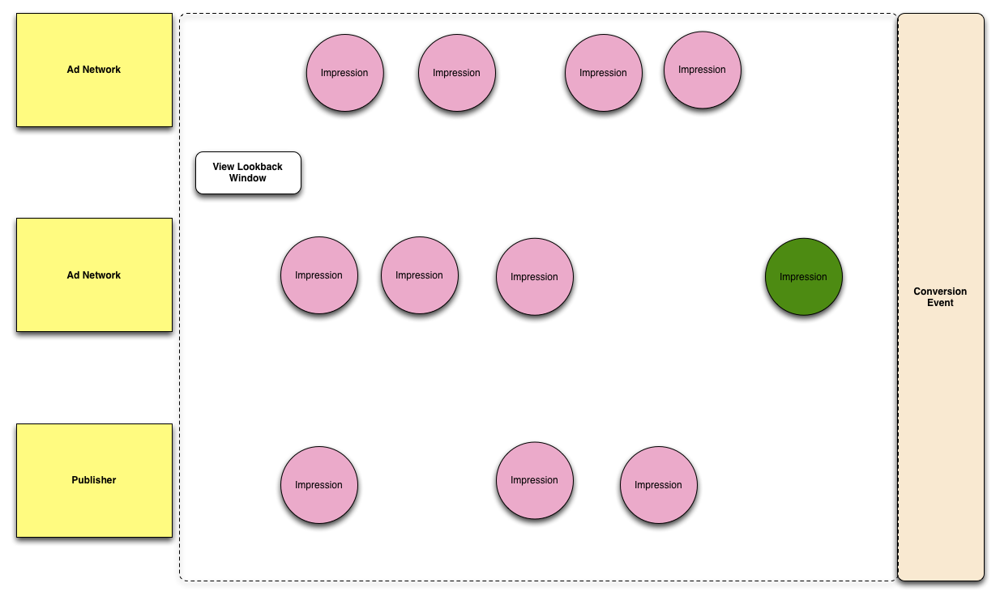
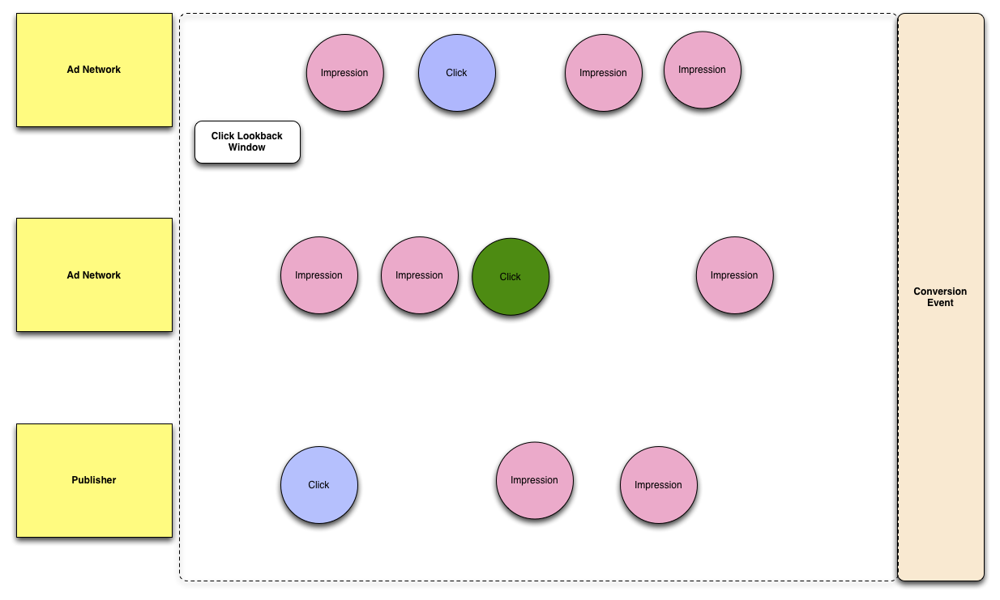
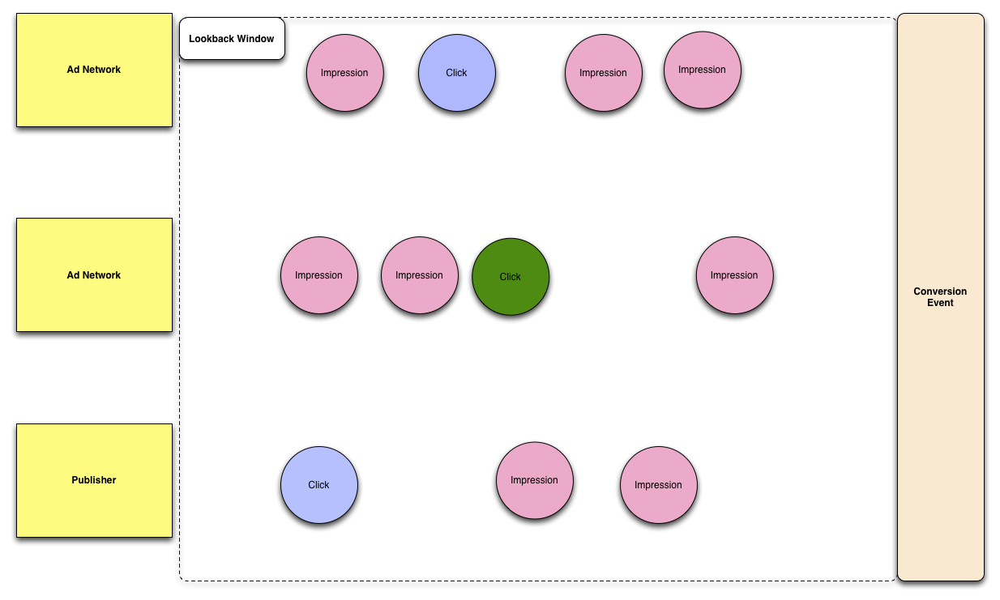
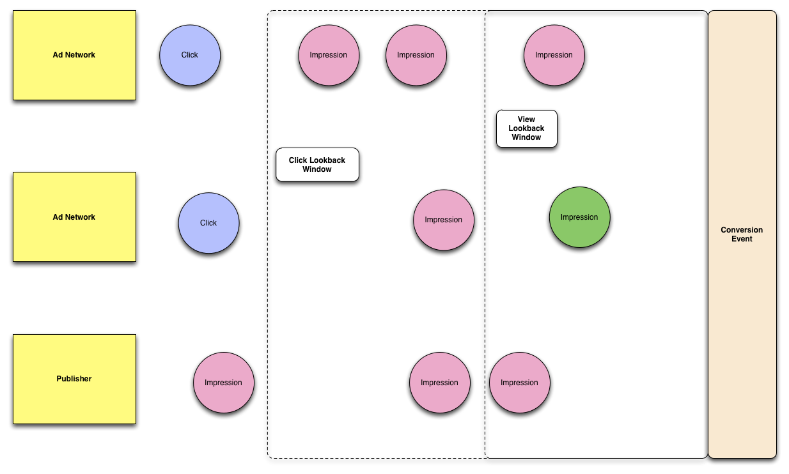

# Conversion attribution for Microsoft Invest

When an advertiser's conversion pixel loads,
Xandr determines if that pixel load can be
associated with a user, and if so, whether the user has converted in
response to having previously viewed or clicked one of the advertiser's
creatives. This process is called conversion attribution.

Xandr performs conversion attribution using the
"post-view/post-click" method. Depending upon whether you've created a
"post-view" or "post-click" conversion pixel, or a "hybrid" conversion
pixel (which is triggered by views **or** clicks), the conversion will
be attributed differently.

Whichever type of pixel you use, an important concept to understand is
the pixel's lookback window (referred to as its **Expiration**). The
lookback window is set by the advertiser for each conversion pixel. It
determines how far back in time to search the user's cookie data for
evidence of a view or click of the advertiser's creative. If a view or
click occurred within the lookback window, it is given credit for the
conversion.

## The Conversion Attribution Process

### Step 1. The user's browser loads the conversion landing page and fires 4the conversion pixel

- If the conversion pixel is not associated with a member with an active
  contract, the conversion is UNATTRIBUTED
- If the conversion pixel is not associated with a line item, the
  conversion is UNATTRIBUTED
- If the conversion pixel is associated with a member with an active
  contract, and if the pixel is associated with a line item, proceed to
  **Step 2**.

### Step 2. Our system checks for a cookie stored by the browser, and attributes the conversion if possible

- If there is no Xandr cookie stored by the
  user's browser, the pixel is recorded as having loaded, but the
  conversion is UNATTRIBUTED.
- If there is one of our cookies stored by the user's browser, the pixel
  is recorded as having loaded, and we check the cookie data for the
  most recent view or click associated with the advertiser's creative.
  If the cookie data does not include a record of a view or click event
  within the user-specified lookback window, the conversion is
  UNATTRIBUTED.
- If our cookie is stored by the user's browser, the pixel is recorded
  as having loaded, and we check the cookie data for the most recent
  view or click associated with the advertiser's creative. If the cookie
  data includes a record of a view or click event within the
  user-specified lookback window, the conversion is ATTRIBUTED.

## Attribution Examples

There are three types of conversion pixels: **View**, **Click**, and
**Hybrid**. Each of the three pixel types is configured to use a
lookback window which determines how far back in time our system will
look for an event of that type (view, click, or both). In the case of
hybrid conversion pixels, the lookback windows for views and clicks can
be configured separately. The following diagrams illustrate how our
system determines attribution given each of the three types of
conversion pixel.

> [!NOTE]
> In all of the following examples, the phrases "last impression" or "last click" are shorthand for "the last impression or click event logged in the Xandr cookie stored in the user's browser".

## View Conversion Pixel

When using **View** conversion pixels, conversions are attributed to the
last impression that occurs before the conversion. In the diagram below,
as time flows from left to right, the last impression inside the **View
Lookback Window** before the conversion happens is credited, and is
marked in green.

## Click Conversion Pixel

When using **Click** conversion pixels, conversions are attributed to
the last click that occurs before the conversion. In the diagram below,
the last click inside the **Click Lookback Window** is before the
conversion happens is credited, and is marked in green.

## Hybrid Conversion Pixel, Single Lookback Window

When using **Hybrid** conversion pixels, either views or clicks can be
credited for conversions. The lookback window for views and clicks can
be configured separately. If both impressions and clicks are attributed
using the same lookback window, the following rules apply:

- The most recent click is always given credit for the conversion. This
  is true even if there are impressions which have occurred more
  recently than the click.
- If there are no clicks, only impressions, the most recent impression
  is attributed.
- If there are no clicks or impressions, the conversion is not
  attributed.

In the example diagrammed below, both impressions and clicks have been
configured with the same lookback window. (This is highly unlikely.)
Since clicks receive preference over views that occur within the same
lookback window, the most recent click has been credited with the
conversion, and is marked in green.

## Hybrid Conversion Pixel, Separate Lookback Windows

In the most common use case for **Hybrid** conversion pixels,
impressions are given a much shorter lookback window than clicks. This
means that a click further in the past will be credited with a
conversion over a more recent impression. In the diagram below, a click
(marked in green) has occurred within the longer **Click Lookback
Window**, and is given credit for the conversion over a number of more
recent impressions.

In the diagram below, a **Hybrid** conversion pixel has been configured
with a short **View Lookback Window** and a longer **Click Lookback
Window**. There are no clicks within the click lookback window,
therefore the most recent impression within the view lookback window
(marked in green) is credited for the conversion.

## Related topic

- [Offline
  Conversion Attribution](offline-conversion-attribution.md)
