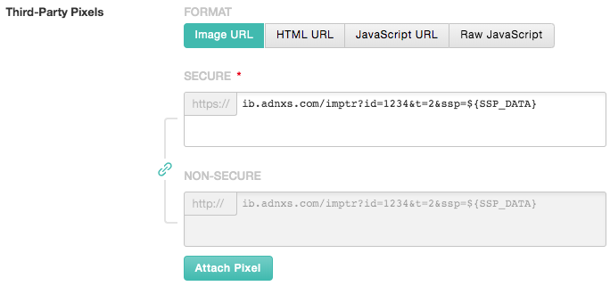

# Server-Side Conversion Pixels


Use Case

Server-side conversion pixels, also known as postback URLs, are used in
situations where normal Xandr cookie-based
conversion tracking is unavailable or not used. A major use case for
server-side pixels is to track conversions on mobile devices where app
sandboxing (the inability of one mobile app to communicate with another)
and a lack of cookies prevent a conversion from being recorded in a
conventional manner.

For instance, if the conversion is a user downloading and installing an
app from the Apple App Store, a normal conversion pixel could not track
a user completely through this process; however, a server-side pixel
would allow for this conversion to be tied to a specific auction.

This page makes references to an attribution server. This is a server
that is set up to capture the server-side pixel token data, attribute a
conversion, and notify Xandr of a successful
conversion.

How Server-Side Pixels Work


Getting the URL for a Server-Side Pixel Call

For server-side conversion pixels, you'll need to generate a URL that
you can call, instead of an HTML-based pixel that is placed on a
publisher's web page. To do this, consult the
Explore Advanced Options section of
the
<a href="export-conversion-pixels.md" class="xref">Export Conversion
Pixels</a> page. The URL that is generated when you export the pixel
will look something like this:


Adding Parameters to an Server-Side Pixel Call

You can add the following parameters to any SSPX call:

- `order_id`
- `value`
- `other`

To use these parameters, you must insert them into the query string
before the `sspdata` parameter. For more details about these parameters,
see
<a href="conversion-pixels-advanced.md" class="xref">Conversion Pixels
Advanced</a>.

The following is an example of a server-side conversion pixel call with
additional parameters:

``` pre
https://sspx-router.adnxs.com/sspx?id=25619&order_id=1234&value=5678&sspdata=ams1AAAAAAAAkQC8rFPulI3JKKU9tUKckv1Oj1WFMAAAAAGULAAA3AAAAUQIAAD4AAA 
```


<b>Note:</b> The sspx handler is supported
over only in secure (https://secure.adnxs.com/sspx) mode.


Testing a Server-Side Pixel

1.  Serve yourself a line item on a test page
    using a test placement. The line item must
    include a landing page with the SSP token.

2.  Click through the ad and see the token populate in the URL.

3.  Copy the token from the http header and fire it back to
    Xandr using the command line. The call for
    this looks like

    ``` pre
    curl --verbose -L 'https://sspx-router.adnxs.com/sspx?id=78874&sspdata=nym1CJjYiJ3oq6LkMxACGIHey7vM0vGDRyIJMTAuMS4xMi42KAE.' 
    ```

    Please note:

    - `id` is the pixel ID from Xandr
    - `sspdata` is the populated ${SSP_DATA} token; the length of this
      string is susceptible to change

Gotchas

- The sspx-router call when a user converts often includes a 302
  redirect. The redirect must be followed for a conversion to be logged.
  When using the command line tool, cURL, be sure to include ""-L
  command in the call to allow the redirect.
- Server-side pixels cannot be used to add or remove users from
  segments. However, a normal, client-side pixel can add or remove users
  from segments; see
  <a href="conversion-pixels-advanced.md" class="xref">Conversion Pixels
  Advanced</a>.
- The `sspdata` parameter must be the last parameter listed in the
  conversion call sent from the attribution server to
  Xandr.
- Server-side pixel data tokens typically have a period at the end,
  which must be included in calls.

Investigations

To investigate issues or discrepancies with server-side pixels,
Xandr must be provided with verbose logs of the
pixel fires because these calls provide the information needed to do an
investigation.

Alternate Use Case: Post-View Conversions

The steps are the same as above, but in Step 4, you will add the macro
to an impression tracking pixel instead of the creative's landing page
URL:




Note that with this method, you will have an SSP_DATA token for every
single impression rather than for only clicks.

Related Topics

- <a href="create-a-conversion-pixel.md" class="xref">Create a
  Conversion Pixel</a>
- <a href="export-conversion-pixels.md" class="xref">Export Conversion
  Pixels</a>
- <a href="conversion-attribution.md" class="xref">Conversion
  Attribution</a>


