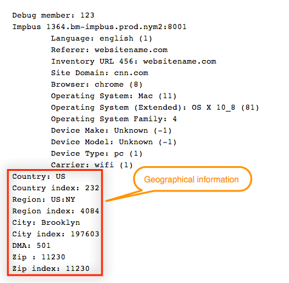
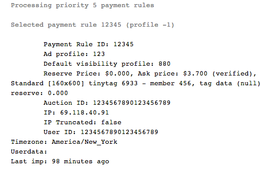
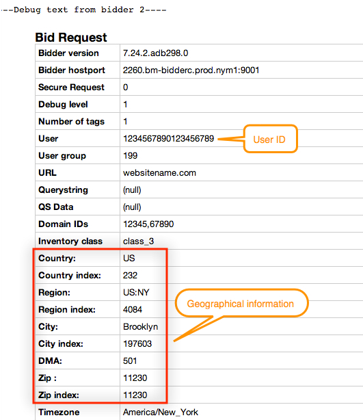
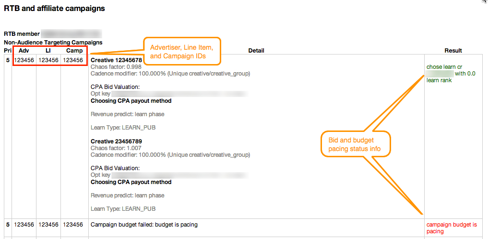
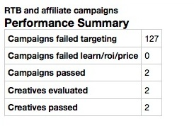
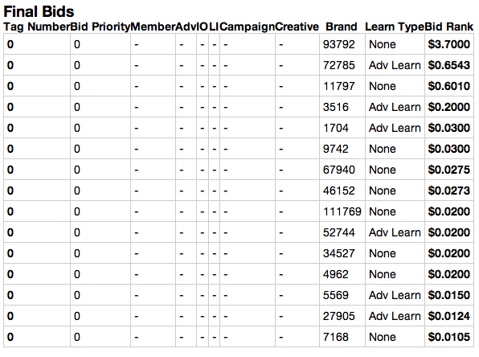

# Microsoft Invest - understanding the debug auction

To understand what is happening behind the scenes during an auction, you
can run a debug auction. This page explains how to run a debug auction
and how to read the output you receive.

## Running a debug auction

A debug auction simulates a real auction without actually logging or serving anything and shows the results in your browser. The log shows the impression bus communicating with all active bidders (including Xandr) and then shows the member-specific
decisioning.

A debug auction can be run using the following calls:

> [!NOTE]
> All debug auction and browser cookie override calls must use secure https protocols. Requests made using http will not generate valid results.

**Production/Beta Environment:**

``` pre
https://ib.adnxs.com/tt?id=[TAG_ID]&size=[WIDTH]x[HEIGHT]&debug_member=[BUYER_MEMBER_ID]&dongle=[PASSWORD] 
```

**Client-Testing Environment:**

``` pre
https://ib-test.adnxs.com/tt?id=[TAG_ID]&size=[WIDTH]x[HEIGHT]&debug_member=[BUYER_MEMBER_ID]&dongle=[PASSWORD] 
```

**Video Creatives:**

Make sure to use a **ptv** tag instead of a **tt** tag while running a
debug auction for video creatives.

``` pre
https://ib.adnxs.com/ptv?id=[TAG_ID]&debug_member=[BUYER_MEMBER_ID]&dongle=[PASSWORD] 
```

## Parameter syntax

| Parameter | Definition |
|---|---|
| id | The ID of the placement tag you will run a debug auction for |
| size | Size of the placement to run, used for sizeless tags |
| dongle | The member's unique debug password |
| debug_member | The ID of the member running the debug auction |

## Optional Parameters

| Parameter |  |
|---|---|
| bidder | The bidder ID. Xandr Invest uses bidder ID 2 in production |
| referrer | Simulate the referring URL from which the ad call is coming |
| prefer_learn | Set to "true" to force a prefer learn auction |
| position | Overrides fold position. Can be set to "above" or "below" |
| age | Overrides age (integer) |
| gender | Overrides gender ("male" or "female") |
| debug_json | Converts the auction's HTML output to JSON form when set to "1" and "&bidder_only=1" is appended |
| kw_ prefix | Adds keyword parameters for targeting purposes, for example: "kw_keyname=value1" |

## Optional geo code parameters

| Parameter |  |
|---|---|
| country | Overrides a cookie's current country geo code with whatever is passed as a value. For example: "country=US". See [here](https://dev.maxmind.com/geoip/release-notes/2022#geoip-legacy-databases-have-been-retired) for a complete list of country geo codes. |
| region | Overrides a cookie's current region (state) geo code with whatever is passed as a value. For example: "region=NY". See [here](https://www.maxmind.com/download/geoip/misc/region_codes.csv) for a complete list of region (state) geo codes. |
| city | Overrides a cookie's current city geo code with whatever is passed as a value. For example: "city=New York". See [here](https://developers.google.com/adwords/api/docs/appendix/cities_us?csw=1) for a complete list of city geo codes. |
| postal | Overrides a cookie's current postal code with whatever is passed as a value. For example: "postal=10010". See [here](https://worldpostalcode.com/) to find a particular postal code. |
| DMA | Overrides a cookie's current Designated Market Area (DMA) geo code with whatever is passed as a value. For example: "DMA=501". A DMA divides geographical regions by their television and radio markets. See [here](https://developers.google.com/adwords/api/docs/appendix/metrocodes?csw=1) for info on how to obtain a region's DMA code. |

> [!NOTE]
> If you are trying to spoof a particular region or city, you must include the most general to most specific geographically. For city targeting, you need to include the country, region (state), and city. For example:` &country=US&region=NY&city=New York`. Remember to type out the full city name.

Example

``` pre
https://ib.adnxs.com/tt?id=3457&debug_member=999&dongle=MyDongle 
https://ib.adnxs.com/tt?id=3457&size=728x90&dongle=MyPassWord&debug_member=999&referrer=https://www.appnexus.com 
```

## Important points

> [!NOTE]
> Placement tag IDs can be found in the UI for your direct inventory, but not for real-time inventory. If you do not have a test publisher and placement to use, contact Xandr support at [https://help.xandr.com](https://help.xandr.com)for assistance.

> [!NOTE]
> If an item is out of budget, inactive, or in pacing sleep (i.e. it is spending evenly across the day), it will not appear in the log. Generally, refreshing will cause paced objects to appear (because they will have come out of sleep). But heavily paced objects (e.g. spend $5 evenly with no targeting so there's a lot of sleeping between bids) may not appear in the final list of bidding campaigns.

## Override Xandr browser cookie

When debugging a particular ad campaign, it may help that your browser's cookie contains or excludes the specific user criteria being targeting (e.g. country or segment). Please see the below table for information on how to view/modify your cookie.


> [!IMPORTANT]
>If using the cookie viewer, you must include your member ID and dongle. This ensures you will only see the segments that belong to your member. You can click on the Debug button on any placement and to see your member ID and dongle in the querystring.

| Action | URL |
|---|---|
| View Xandr cookie | [https://ib.adnxs.com/cookie?member_id=MEMBER_ID&dongle=DONGLE](https://ib.adnxs.com/cookie?member_id=MEMBER_ID&dongle=DONGLE) where MEMBER_ID is your member ID, DONGLE is your member-specific dongle |
| Add/remove yourself to/from segments | https://ib.adnxs.com/seg?add=SEGMENT_ID [https://ib.adnxs.com/seg?remove=SEGMENT_ID](https://ib.adnxs.com/seg?remove=SEGMENT_ID) where SEGMENT_ID is the ID of the targeted segment  |
| Override cookie geography data | [https://ib.adnxs.com/cookie?member_id=MEMBER_ID&dongle=DONGLE&country=COUNTRY&region=REGION&dma=DMA&city=CITY&postal=POSTALwhere](https://ib.adnxs.com/cookie?member_id=MEMBER_ID&dongle=DONGLE&country=COUNTRY&region=REGION&dma=DMA&city=CITY&postal=POSTALwhere)Lwhere MEMBER_ID is your member ID, DONGLE is your member-specific dongle, COUNTRY is the targeted country code, REGION is the targeted region code, DMA is the targeted numeric metropolitan code, CITY is the targeted city name, and POSTAL is the targeted postal code (Note that to set city geo, you must set country, region in addition.) |

## Interpreting the debug auction log

- This is a sample debug log run by an Ad Network for a placement that
  it exposed for reselling.
- This particular debug log was run in a deprecated sandbox environment,
  so URLs are slightly different than they would be in the production
  server.
- All IDs have been changed to random numbers.





Xandr's bidder gives more detailed debug text,
beginning with "Debug text from bidder 2" (live). This output includes
information such as the bidder version, the region info., and user info.
Excerpts from a live debug auction are below:




This debug info. continues, including information such as the segments
that the user is in and other relevant objects.


> [!TIP]
> This section highlights the decisions made by the bidder.

The debug auction then prints a table with the headings of Advertiser,
Line Item, Campaign (if applicable), Detail, and Result. This is the
most important part of the debug auction output as it will tell you why
you may not be bidding on impressions for this tag; or if they are, how
much they would bid.

After all ad campaigns are evaluated, you will see the summary table.




You will also see the performance summary.




You will receive an output of all bids and final bids. RTB buyers will
see the value of the bid, the brand ID, and the learn type.



> [!TIP]
> This debug log will also compare the result of Xandr's bidder with the result any other bidders participating in the auction, looking for the winner and the second highest price (since Xandr uses Second Price Auction).

Finally, we show the highest net bid, and the member and creative that
would have served had this not been a debug auction.


## Possible debug auction results

| Result | Explanation | Impression Type in Reporting |
|---|---|---|
| Exclusive | The placement is not enabled for reselling, and the auction was won by a managed bid | Kept |
| Reserve Not Met | The placement is enabled for reselling, and the auction was won by a managed bid | Kept |
| Sold | The placement is enabled for reselling, and the auction was won by a third-party bid | Sold |
| PSA | The auction did not have a winner, and a PSA was shown in place of an ad | PSA |
| Default | The auction did not have a winner, and a default creative was shown in place of an ad | Default |

## Quick reference: debug auction data

| Debug Data | Visible to Sellers and in Direct Auctions | Visible to RTB Buyers |
|---|---|---|
| Ad profile | Yes | No |
| Ask price | Yes | No |
| Auction ID | Yes | Yes |
| Audience Targeting Campaigns | Yes | Yes |
| Bid Request | Yes | Yes |
| Bidder hostport | Yes | Yes |
| Bidder Version | Yes | Yes |
| Browser | Yes | Yes |
| Carrier | Yes | Yes |
| City | Yes | Yes |
| City index | Yes | Yes |
| Country | Yes | Yes |
| Country index | Yes | Yes |
| Debug level | Yes | Yes |
| Debug member | Yes | Yes |
| Default visibility profile | Yes | No |
| Device Make | Yes | Yes |
| Device Model | Yes | Yes |
| Device Type | Yes | Yes |
| Domain IDs | Yes | Yes |
| Estimated average price | Yes | No |
| Estimated clear price | Yes | Yes |
| Final Bids | Yes | Yes |
| Fold position | Yes | Yes |
| Giveup Price | Yes | No |
| Hour of Week ID | Yes | Yes |
| Inventory Class - **Deprecated** | -- | -- |
| Inventory Groups - **Deprecated** | -- | -- |
| Inventory Source - **Deprecated** | -- | -- |
| Inventory Source ID - **Deprecated** | -- | -- |
| IP | Yes | Yes |
| IP Truncated | Yes | Yes |
| Language | Yes | Yes |
| Latitude | Yes | Yes |
| Longitude | Yes | Yes |
| Media Subtype | Yes | Yes |
| Net winning price | Yes | Yes |
| Non-Audience Targeting Campaigns | Yes | Yes |
| Number of tags | Yes | Yes |
| Offset from UTC | Yes | Yes |
| Operating System | Yes | Yes |
| Operating System (Extended) | Yes | Yes |
| Operating System Family | Yes | Yes |
| Payment Rule | Yes | No |
| Payment rule ID | Yes | No |
| Performance summary | Yes | Yes |
| Prefer learn | Yes | Yes |
| Processing priority | Yes | No |
| Publisher ID | Yes | Yes |
| QS Data | Yes | Yes |
| Querystring | Yes | Yes |
| Referrer | Yes | Yes |
| Region | Yes | Yes |
| Region index | Yes | Yes |
| Reserve price | Yes | No |
| RTB and affiliate campaigns | Yes | Yes |
| RTB member | Yes | Yes |
| Second bid | Yes | Yes |
| Secure request | Yes | Yes |
| Second net price | Yes | Yes |
| Segments | Yes | Yes |
| Selected payment rule | Yes | No |
| Sell-side page caps enabled | Yes | No |
| Soft floor | Yes | Yes |
| Supply type | Yes | Yes |
| tag data | Yes | Yes |
| Tag ID | Yes | Yes |
| Timezone | Yes | Yes |
| Tinytag | Yes | Yes |
| URL | Yes | Yes |
| User | Yes | Yes |
| User group | Yes | Yes |
| User ID | Yes | Yes |
| Venue ID | Yes | Yes |
| Visibility Profile ID | Yes | Yes |
| Winning bid | Yes | Yes |


## Running a test auction

In addition to debug auctions, which simulate real auctions without logging or serving ads, you can also run a test auction. Test auctions are designed to allow clients to test if their ads are being delivered as expected and verify that everything is configured correctly.

Like a debug auction, in a test auction Xandr does not transact the impression; no one will be paid or billed, nothing is logged, and no ads will be served. In addition, in a test auction, the actual content of the ad being sent is ignored; even if a banned creative is sent, a test auction will not result in an IP being blocked.

To run a test auction, add the `test=1` parameter to an ad call; for
example:

``` pre
https://ib.adnxs.com/tt?id=1234&test=1 
```

If the ad is visible in a browser, the configuration is valid.

# Related topic

- [Mobile Debug Auction Tips](mobile-debug-auction-tips.md)
