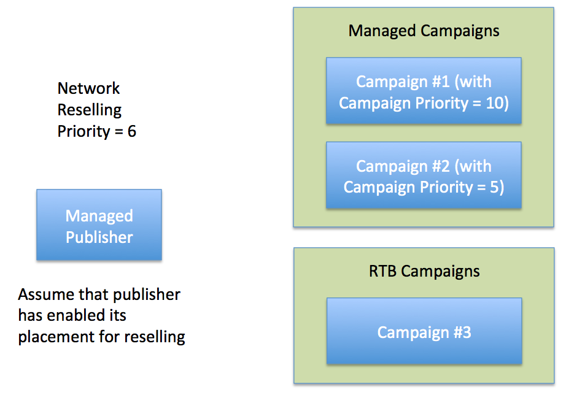
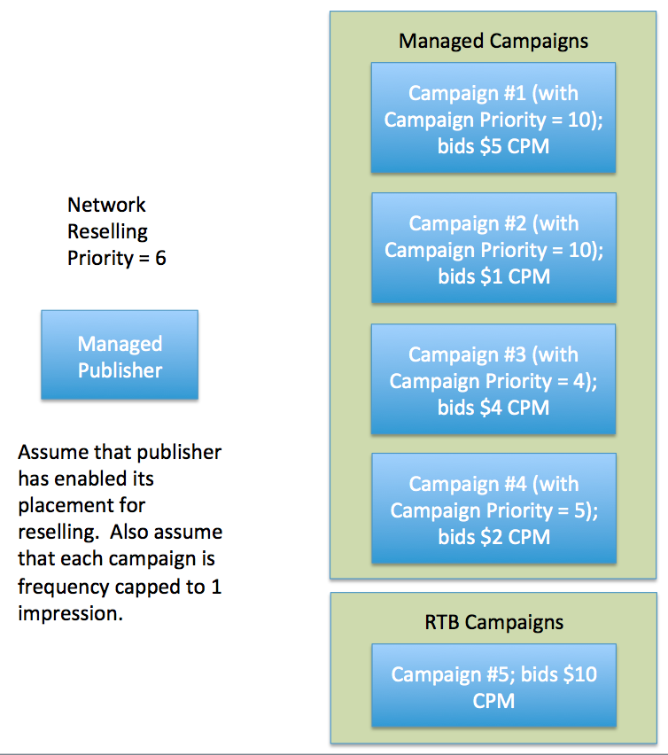

# Bidding Priority

When managing inventory on the Xandr platform,
you have several methods of controlling bidding priority.

This page contains descriptions of those methods, as well as links to
further information.

<b>Note:</b> **Xandr
Adserver clients**, see
<a href="open-dynamic-allocation-and-flexible-priorities.md"
class="xref">Open Dynamic Allocation and Flexible Priorities</a> for
information on how bidding priorities work with guaranteed delivery.

Managed Priority at a Campaign-Specific level

<b>Important:</b>

Priorities apply only to buying direct inventory.

At a high level, priorities represent how you as the network will
prioritize a particular campaign against other direct and external
campaigns buying your inventory. When you
<a href="create-a-campaign.md" class="xref">Create a Campaign</a> and
select Buy Direct Inventory under
Buying Strategies, you'll see a
**Campaign Priority** drop-down. From this drop-down you can select a
value that can be used to force one or more direct-inventory campaigns
to have bidding priority over others: your highest priority
direct-inventory campaign within your account will always take
precedence over other campaigns which have lower priority within your
account, regardless of any one campaign's bid price.

As an example, if campaign A is set to priority 6 and all other
campaigns across your network are priority 5 (the default), any time
campaign A competes in a direct inventory auction it will beat all of
your other campaigns, regardless of their individual bids. In other
words, even campaigns that bid higher than campaign A will lose the
auction because campaign A has a higher priority setting.

Managed Buying and Third-Party Buyer Prioritization

In addition to the priority setting on the campaign, there is a setting
at the Network level for **Reselling Priority** you can set on the
Network Tools screen
(Network 
\>  Tools  \>
 General). Reselling Priority
is the threshold at which third-party bids (from other networks on the
Xandr platform and from external buyers) become
eligible to serve on your inventory. For example, if you set your
Reselling Priority to 8, managed campaigns at Priority 10, 9, and 8 will
serve before bids from third parties (RTB bids), even if third-party
bids are higher.

For more details, see
<a href="managing-your-inventory-reselling-exposure.md"
class="xref">Managing Your Inventory Reselling Exposure</a>.

<b>Tip:</b> Adjusting this setting can affect
your entire account structure. Reach out to your account team if you
have concerns or want to discuss the best way to implement this feature
set for your account.

Combining Reselling (Network) Priority and Campaign Priority

The two priorities work together to determine how demand will compete:

- Reselling priority: Reselling priority governs when inventory is
  available for resale to third-party (RTB) demand. When a campaign from
  a managed advertiser has a priority value at or above reselling
  priority and is eligible for an impression, then the impression is not
  available to RTB buyers. (See
  <a href="managing-your-inventory-reselling-exposure.md"
  class="xref">Managing Your Inventory Reselling Exposure</a> for more
  information.)
- Campaign priority: The priority assigned to the campaign. The default
  value is 5.

Here's an example of how the two types of priority interact together:

Let's assume you have a managed publisher on your network that has
enabled their placements for reselling, and both managed and RTB
campaigns are buying your inventory.

Campaign \#1 has a higher priority (10) than Campaign \#2 (5), so
Campaign \#1 would serve before Campaign \#2. In addition, Campaign \#1
has a priority greater than the Reselling Priority (6), so RTB bids will
not be considered. Therefore, in this example Campaign \#1 serves before
both Campaigns \#2 and \#3.

Note, however, that if pacing is enabled, budget has run out, or
<a href="frequency-and-recency-caps.md" class="xref"
title="From the Audience &amp; Location Targeting section, you can apply frequency and recency caps to your line item to prevent overexposure by limiting how many (frequency) and how often (recency) creatives are shown to a user. You can use the Creative Frequency and Recency Report to view how often and how frequently users are viewing a specific advertiser&#39;s creatives.">Frequency
and Recency Caps</a> are in place for Campaign \#1, then it is possible
for Campaigns \#2 and \#3 to be served impressions over Campaign \#1.

You might have noticed that this example makes no mention to how much
the campaigns are bidding. This is because campaign bidding comes
secondary to campaign priorities. This next example shows where bid
price enters the mix.

Looking at the preceding diagram, the impressions from the managed
publisher will be delivered to the different campaigns in the following
order:

<b>Note:</b> To simplify the example, a
frequency cap of 1 imp over the lifetime of each campaign has been set,
so each campaign will serve a maximum of one time.

1.  Campaigns \#1 and \#2 have the same campaign priority (10), which is
    above the reselling priority (6). In this situation, Campaign \#1
    will be served an impression first because it is bidding a higher
    CPM ($5) than Campaign \#2 ($1).
2.  Now, because we set the frequency cap at 1 impression, Campaign \#1
    is done serving. The next impression will be delivered to Campaign
    \#2, which, of the remaining campaigns, has the highest priority,
    and a priority higher than the reselling priority.
3.  Campaigns \#3 and \#4 have campaign priorities below the reselling
    priority. This means that these two campaigns will compete with
    Campaign \#5, the external RTB campaign. Campaign \#5 is bidding a
    higher CPM ($10) than either Campaign \#3 ($4) or Campaign \#4 ($2),
    so the next impression goes to Campaign \#5.
4.  That leaves Campaigns \#3 and \#4. Campaign \#4 has a higher
    priority (5) than Campaign \#3 (4), so Campaign \#4 serves next.
5.  The final impression goes to Campaign \#3.

Related Topics

- <a href="create-a-campaign.md" class="xref">Create a Campaign</a>
- <a href="explore-campaigns.md" class="xref">Explore Campaigns</a>
- <a href="view-campaign-details.md" class="xref">View Campaign
  Details</a>
- <a href="open-dynamic-allocation-and-flexible-priorities.md"
  class="xref">Open Dynamic Allocation and Flexible Priorities</a>

