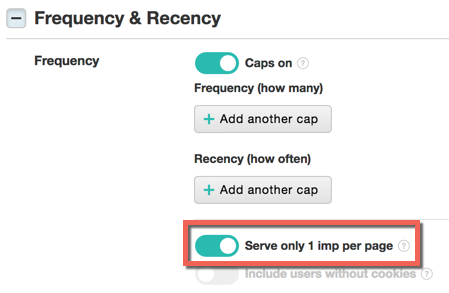

# Buy-Side Page Caps

When you run multi-tag auctions via <a
href="seller-tag/seller-tag/seller-tag.md"
class="xref" target="_blank">Xandr's seller
tag</a>, you get the ability to set page caps. Page caps can be used to
restrict advertisers, line items, campaigns, or brands from winning more
than one ad slot per AST ad call.

Buy-side page caps (advertiser, line item, and campaign) can be used to
exclude similar campaigns from serving with each other. However, they
don't cover the use case where you only want one impression per brand to
show on an AST ad call, no matter the buyer. That use case is covered by
<a href="sell-side-page-caps.md" class="xref">Sell-Side Page Caps</a>.

<b>Important:</b> This feature is not
available to clients by default. If you would like to enable this
feature, please speak with your Xandr
representative.

class="note important note_important">

<b>Important:</b> Buy-side page caps are also
enforced on OpenRTB calls.

Enable page caps for an advertiser

To set up buy-side page caps, select
Advertisers
 \>  All Advertisers.
Click the edit button that appears to the right of the advertiser name.

On the **Edit Advertiser** page,
expand the Frequency & Recency
section. Toggle to turn **Caps On**. Select
Serve only 1 imp per page.

<b>Note:</b> Frequency and Recency options are
also available at the line item, campaign, and creative level. See
<a href="frequency-and-recency-caps.md" class="xref"
title="From the Audience &amp; Location Targeting section, you can apply frequency and recency caps to your line item to prevent overexposure by limiting how many (frequency) and how often (recency) creatives are shown to a user. You can use the Creative Frequency and Recency Report to view how often and how frequently users are viewing a specific advertiser&#39;s creatives.">Frequency
and Recency Caps</a> for more information.

<b>Important:</b> Note that roadblocks are
counted as single creatives when applying per page frequency caps.

Example Buy-Side Scenarios

The following examples show in more detail how buy-side page caps work.

Example Buy-side Cap in Action, Enforcing Correctly

Let's say you have the following setup:

- A page with a single AST ad call for two ad slots
- Two campaigns for Coca-Cola under the same advertiser, both at
  priority 5
- A single campaign for Nike, at priority 4
- You never want to show both Coca-Cola campaigns at the same time to
  one user

If you apply page caps to the Coca-Cola advertiser and run the AST ad
call, the following will happen:

- Ad slot 1 goes to the first Coca-Cola campaign at priority 5
- The second Coca-Cola campaign is excluded from winning ad slot 2, so
  Nike wins instead
- Bids are returned to the Impbus and external bidders (if allowed) can
  bid
- Coca-Cola wins ad slot 1, Nike wins ad slot 2

Example Buy-side Cap in Action, Enforcing Correctly, but Not as Expected

Let's say you have the same setup as described above. If you apply page
caps to the Coca-Cola advertiser and run the AST ad call, the following
could happen:

- The two Coca-Cola campaigns and the single Nike campaign are returned
  to the Impbus for decisioning
- External bidder comes in and bids $10 CPM for a Coca-Cola ad in ad
  slot 2
- If the $10 CPM bid has a higher expected network revenue than the Nike
  bid, then it will win
- Ad slots return to the page, user sees Coca-Cola ads in both slots

To avoid this outcome, we recommend enabling
<a href="sell-side-page-caps.md" class="xref">Sell-Side Page Caps</a>.

Related Topics

- <a href="create-a-campaign.md" class="xref">Create a Campaign</a>
- <a href="buying-guide.md" class="xref">Buying Guide</a>
- <a
  href="seller-tag/seller-tag/seller-tag.md"
  class="xref" target="_blank">Seller Tag (AST)</a>
- <a href="sell-side-page-caps.md" class="xref">Sell-Side Page Caps</a>

