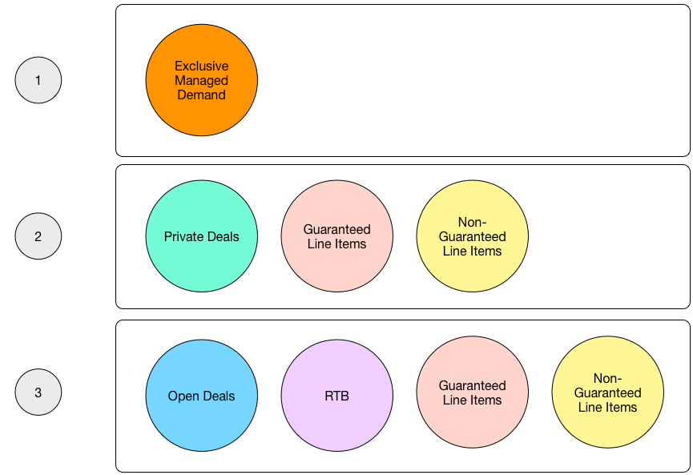

# Guaranteed Delivery Auction Mechanics

<b>Important:</b> This option is available
only to Xandr Ad Server customers.

This page describes how auctions involving guaranteed line items work.
If you are looking for information about how guaranteed line item pacing
and delivery works, see
<a href="guaranteed-delivery-pacing.md" class="xref">Guaranteed
Delivery Pacing</a>. If you need an introduction to what guaranteed line
items are and how they work at a high level,
<a href="guaranteed-delivery.md" class="xref">Guaranteed Delivery</a>.

How Guaranteed Delivery Auctions Work

When guaranteed line items are eligible to bid on an impression, the
auction works as follows:

1.  The ImpBus sends a bid request to the Bidder.
2.  When the Bidder receives the bid request, it prepares to respond
    with - at most - one guaranteed bid and up to 14 non-guaranteed
    bids.
3.  The Bidder ranks the guaranteed bids against each other according to
    their priority, and chooses one guaranteed bid to send to the
    ImpBus. If two guaranteed bids have the same priority, they will be
    compared to see which line item is further from its goal. The bid
    whose line item is furthest from goal is much more likely to serve.
    Which bid is selected is not strictly based on distance from goal;
    there is a weighted rotation established where line items further
    from goal are assigned a higher relative weight.
4.  If the selected guaranteed bid is of the "Exclusive" Delivery Type,
    only the guaranteed bid is sent to the ImpBus, where it will serve
    without any competition from other bids.
5.  If the guaranteed bid is of "Impressions" Delivery Type, the Bidder
    sends at most one guaranteed bid plus up to 14 non-guaranteed bids.
    The Bidder calculates a pCPM (priority CPM) to allow the guaranteed
    bid to compete with other bids (including RTB) in the auction held
    by the ImpBus. The pCPM value represents the risk that the line item
    will not deliver in full. The "risk" is defined by considering
    factors such as pace towards goal and scarcity of inventory. The
    more "at risk" the line item is of not achieving its goal, the
    higher the pCPM value will be.

For information about how to set your reselling priority, see
<a href="bidding-priority.md" class="xref">Bidding Priority</a>. For
information on how guaranteed and standard line items compete based on
priority, see
<a href="open-dynamic-allocation-and-flexible-priorities.md"
class="xref">Open Dynamic Allocation and Flexible Priorities</a>.

Price Reduction and Bid Ranking

Guaranteed line items have the following behavior during the price
reduction and bid ranking steps (which occur in the Imp Bus):

- When a guaranteed line item with a pCPM value is ranked second to a
  winning RTB bid, the RTB bid should price reduce to the pCPM value of
  the guaranteed line item, even if pCPM is below the guaranteed line
  item's price.
- pCPM is used to rank bids, but when a guaranteed line item wins the
  auction, it still pays the booked line item price, not the pCPM value.

Roadblocks and Guaranteed Line Items

Guaranteed line items' roadblocks serve (or not) based on their priority
and distance from goal. In order for a standard roadblock to serve over
a guaranteed roadblock, the average CPM from the standard roadblock
across all of the tags involved must be higher than the pCPM for the
guaranteed roadblock. (See example \#3 below for more information.)

The following examples show how Guaranteed Delivery roadblocks behave in
different scenarios:

1.  **Guaranteed Roadblock vs. Guaranteed Line**: Guaranteed roadblocks
    compete with guaranteed lines on their target delivery rate using
    the same method as for guaranteed line vs. guaranteed line
    competition. The guaranteed roadblock gets to serve if it wins all
    of the tags it is targeting and eligible to serve on.
2.  **Guaranteed Roadblock vs. Standard Line**: Guaranteed roadblocks
    don't directly compete with standard line items. A guaranteed
    roadblock will always win over a standard line item if it is
    eligible to serve.
3.  **Guaranteed Roadblock vs. Standard Roadblock**: The average CPM of
    the tag bids from the standard roadblock is compared with the pCPM
    of the guaranteed roadblock. Expressed as a formula:
    `[sum(all CPM bids) / number of ad slots]` vs. `pCPM`.
4.  **Guaranteed Line vs. Standard Roadblock**: Uses the same logic as
    for \#3.

Deals and Guarantees

Sellers can use Deals to provide buyers special access to inventory
and/or data. If you use Deals and Guaranteed line items together, the
diagram below shows the order in which the different bid types (Deals,
Guaranteed line items, RTB) are prioritized in the auction:

1.  If **Exclusive Managed Demand** is present, no other bid types can
    win the impression. This exclusive managed demand includes
    Guaranteed line items of the **Exclusive** delivery type (priorities
    18-20).

2.  If **Private Deals** are bidding on the impression, only managed
    demand can compete. The managed demand includes Guaranteed line
    items (with the **Impressions** delivery type), and non-guaranteed
    demand.

3.  If **Open Deals** are bidding on the impression, then RTB and
    managed demand can compete. The managed demand includes Guaranteed
    line items (with the **Impressions** delivery type) and
    non-guaranteed demand.

    

For more information about deals, see
<a href="selling-deals.md" class="xref">Selling Deals</a>.

Related Topics

- <a href="guaranteed-delivery.md" class="xref">Guaranteed Delivery</a>
- <a href="selling-deals.md" class="xref">Selling Deals</a>
- <a href="bidding-priority.md" class="xref">Bidding Priority</a>
- <a href="managing-your-inventory-reselling-exposure.md"
  class="xref">Managing Your Inventory Reselling Exposure</a>
- <a href="create-a-guaranteed-delivery-line-item.md"
  class="xref">Create a Guaranteed Delivery Line Item</a>
- <a href="guaranteed-delivery-pacing.md" class="xref">Guaranteed
  Delivery Pacing</a>
- <a href="target-your-inventory-with-roadblocking.md"
  class="xref">Target Your Inventory with Roadblocking</a>

