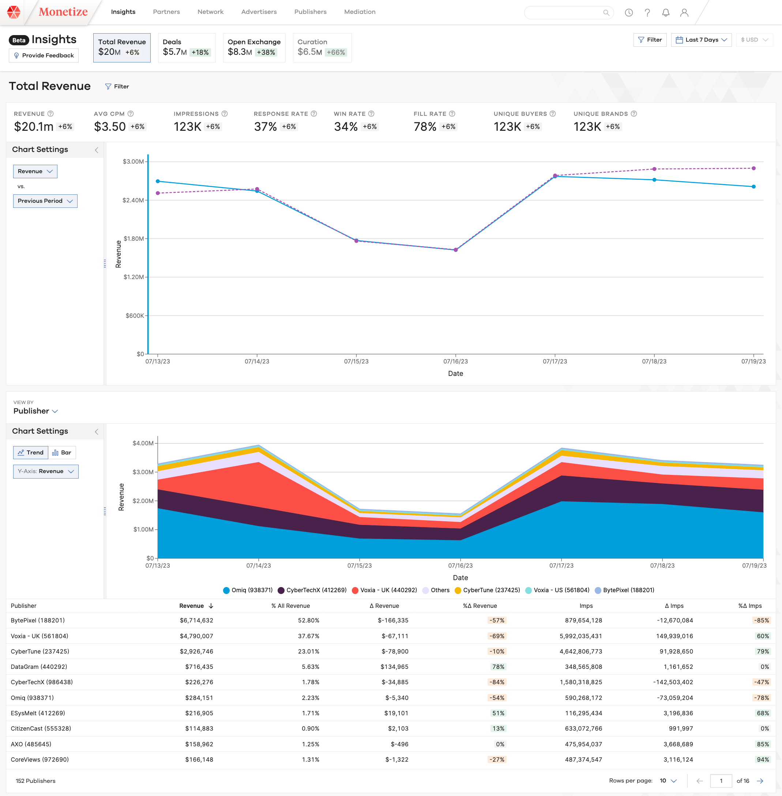
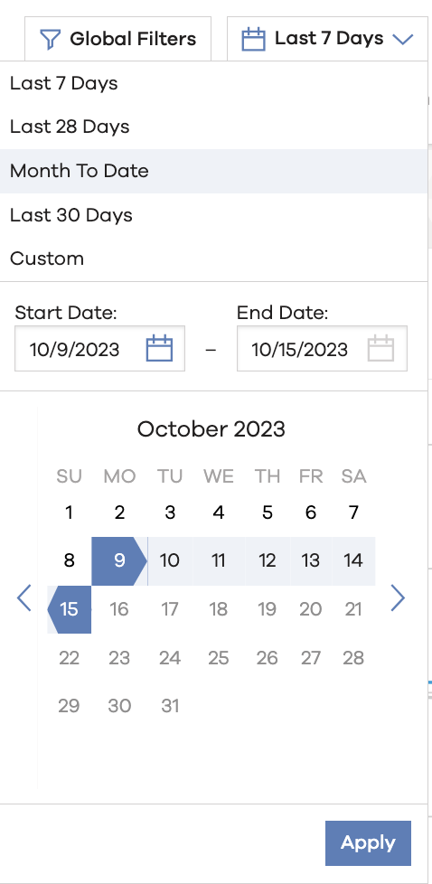
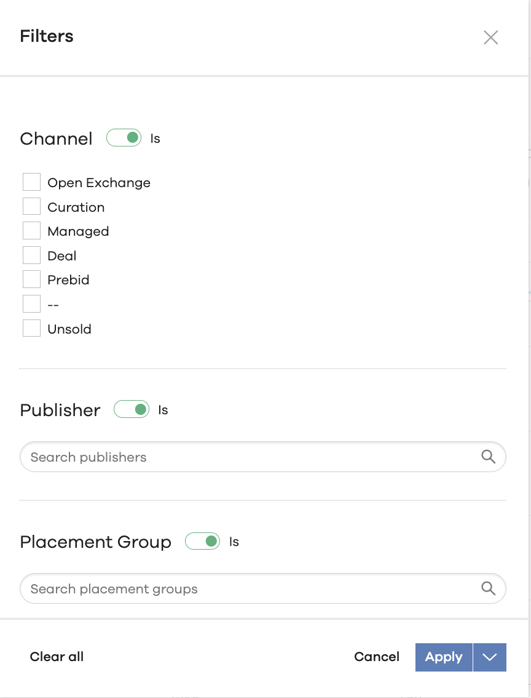
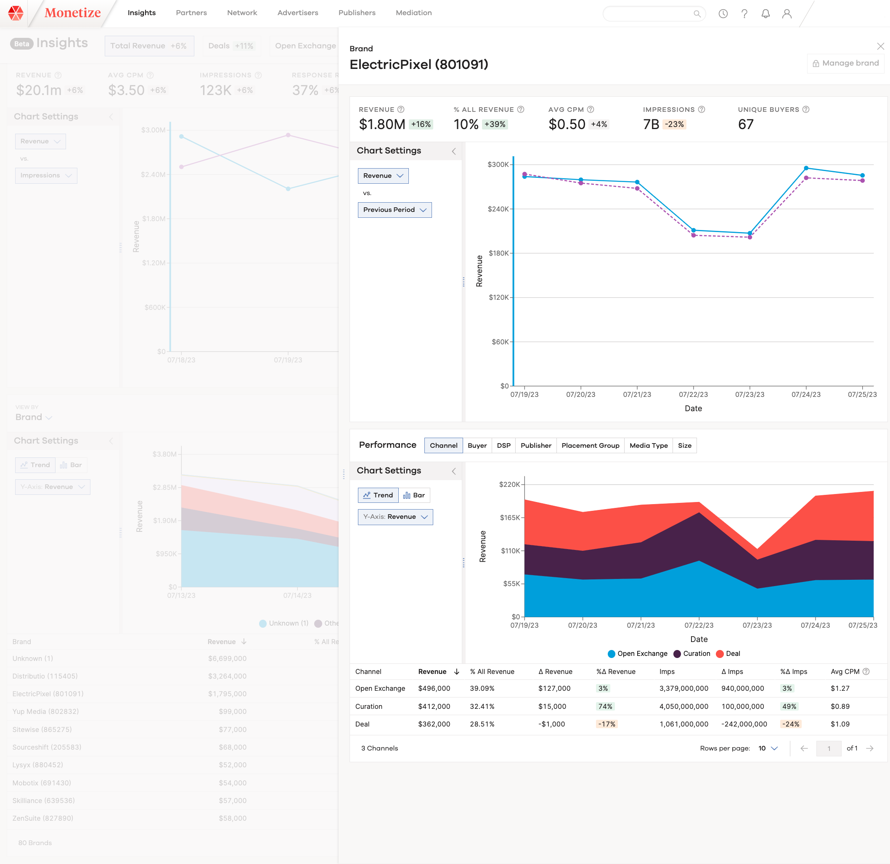

# **Monetize Insights for Total Revenue**

The Total Revenue tab of
Monetize Insights offers a
convenient method for monitoring business performance and key
performance indicators (KPIs), such as:

- Revenue
- Impressions
- Ad Requests
- Fill Rate
- Win Rates

Analyzing trends and significant changes is made easy by dissecting the
data based on different dimensions, such as:

- Channel
- Buyer,
- DSP
- Brand
- Publisher
- Placement Group

Users can customize the screens with filters, specific to an inventory
or demand pertinent to their roles. Delving further into the data is a
straightforward process, simply click on the table to reveal specific
metrics for the selected criteria.

>

## **Navigation Bar, Global Filters and Date Selection**

The Navigation bar located at the top of the
Insights page allows you to
seamlessly switch between Total
Revenue, offering a comprehensive view of KPIs and trends across
all channels, and individual channels. At the global level, you can
apply filters that will be effective across all tabs in
Insights, in addition to choosing
specific date ranges, with the flexibility to select a date range
spanning up to 31 days ago, and an option to compare it to the
immediately preceding time period, as far back as 62 days ago. The data
is presented with a daily granularity in the UTC time zone, and the most
recent data available corresponds to the prior day once the processing
for that day is completed.

## **KPIs and Total Revenue Filters**

There are several several key performance indicators (KPIs) offering a
quick snapshot of your business' overall health, including:

- Revenue
- CPM
- Impressions
- Response Rate
- Win Rate
- Fill Rate
- Unique Buyers
- Unique Brands

Each metric is accompanied by the percentage change from the comparison
time period, with positive or negative highlights indicating significant
changes. For detailed information on each KPI, hover over the
"?" symbol and click on the relevant
KPI, which will update the chart below with the metric trend for the
current and comparison time periods.

Each Insight tab has further
granular filtering which can be applied to that specific tab. On the
Total Revenue tab granular filtering
can be performed on:

- Channel
- Publisher
- Placement Group
- Media Type
- DSP
- SSP
- Advertiser
- Insertion Order
- Buyer
- Brand
  

  <b>Note:</b> It is possible to use filters
  to include or exclude specific values.

  

>

## **Trend Comparison Chart**

The trend comparison chart illustrates the correlation between the
current and comparison time periods or, alternatively, the correlation
between two different metrics, such as Impressions and Revenue, as shown
below. The available metrics that can be plotted on the chart include:

- Revenue
- Impressions (All impression types, including blanks, PSAs, and
  Defaults)
- Imps Sold (Kept and Resold impression types)
- CPM (Revenue divided by all Impressions)
- Ad Requests
- Ad Responses
- Win Rate (Imps sold / Ad Responses)
- Fill Rate (Imps Sold / Ad Requests)
- Response Rate (Ad Responses / Ad Requests)

>

## **Detail Chart and Table**

The subsequent section of the Total Revenue page presents a detailed
breakdown of metrics organized by a specific dimension, such as
Publisher. This layout facilitates a clear understanding of the
individual components contributing to the top-line metrics. You can
modify the dimension by utilizing the "View
By" button located at the top right of the section. The top 6
records are displayed for the selected view, while the remaining entries
are grouped under "Other." The
chart's display can be toggled between an area trend chart and a bar
chart. Additionally, the **Y-Axis** metrics are customizable and can be
changed to any of the metrics available in the
Trend Comparison chart.

Below the chart is a table that shows key metrics, such as:

- Revenue
- CPM
- Impressions
  

  <b>Note:</b> The metrics displayed in the
  table indicate both their relative change (∆%) and absolute change
  (∆), and users have the option to sort the columns in this table.

  

>

## **Drill down on the Side panel**

Clicking on a row in the detailed table will open a side panel, allowing
for a quick exploration of the chosen dimension. For example, a
particular brand selected, can reveal details such as revenue
impressions, CPM, the percentage of total revenue, and the number of
unique buyers associated with that particular brand. Subsequently, a
comparative chart is displayed, followed by a detailed chart and table,
all offering the same functionality as the main window.

>

## **Fidelity of Data**

Data within Insights is presented
at a daily granularity in the (UTC) timezone and is updated daily to
reflect data from the previous day (UTC). Adjustments for fixed-fee
managed line items made on the same day are considered, but adjustments
occurring at the end of a multi-day flight are not retrospectively
applied. Metric totals are processed to align with reporting figures,
with the exception of the brand dimension, which serves as an indicative
measure for identifying anomalies.

For the brand dimension, data is processed to reduce data fidelity on
long-tail transactions where the daily revenue from a brand on a
specific placement is less than $5. In this scenario the revenue,
impressions and CPM will be attributed to a category labeled
"Below Threshold." For precise
metrics by brand, it is recommended to utilize reporting tools rather
than relying solely on Insights.

