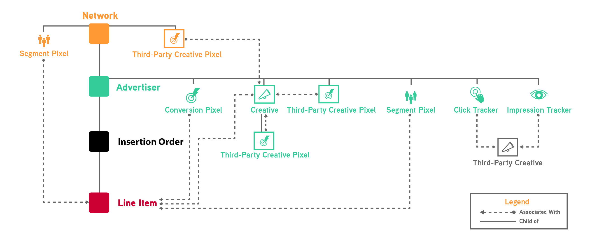
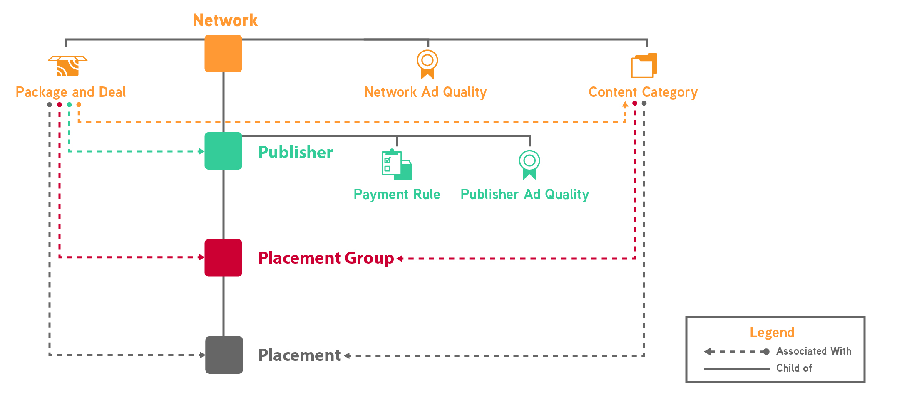

# Object Hierarchy

This page introduces the main objects that you work with to buy
and sell media.

Buy-Side Hierarchy

Overview and Diagram (Augmented Line Item)

>

Key differences of an
<a href="augmented-line-items-ali.md" class="xref">Augmented Line Item
(ALI)</a> compared to Standard Line Items:

- ALIs require Insertion Orders (not optional).
- Targeting, budgeting, bidding strategies, and optimization strategies
  that were associated with campaigns are set on the line item level.
- ALIs do not use campaigns.

Network

The <a href="network-guide.md" class="xref">Network</a> represents your account as a whole. At
this level, you decide who's eligible to sell to you and what level of
inventory audit you require
(<a href="set-seller-defaults.md" class="xref">seller settings</a>),
you create lists of domains and apps for efficient allowlist or
blocklist targeting in campaigns
(<a href="working-with-targeting-lists.md" class="xref">targeting
lists</a>), you put in place a cap on how much you are willing to
spend per day on third-party inventory(<a
href="capping-daily-spend-on-third-party-inventory-safety-budget.md"
class="xref">safety budget</a>), and more.

Advertiser

An <a href="working-with-advertisers.md" class="xref">advertiser</a>
represents a single client or brand on whose behalf you want to serve
ads on web and/or mobile inventory. At this level, you set the defaults
to use in some of the objects under the advertiser (e.g., default
currency, time format, time zone), a brand and offer category to apply
to all creatives under the advertiser, and more.

You can have many advertisers in your network.

Insertion Order

An <a href="working-with-insertion-orders.md" class="xref">insertion
order</a> represents a financial agreement you have with your advertiser
that specifies what they would like you to execute. The insertion order
contains information such as the total budget an advertiser allocates to
you for a period of time, or which third party verification the
advertiser utilizes. Insertion orders also allow you to group line
items and campaigns accordingly.

You can have many insertion orders under a single advertiser.

Line Item

The
<a href="working-with-line-items.md" class="xref">line item(s)</a>
under an advertiser or insertion order represent the agreed upon
strategies you will be executing for the advertiser. It contains
information that the advertiser specifies, such as how much your
advertiser has budgeted toward an offering, or which targeting the
advertiser requires.

You can have many line items under a single advertiser or insertion
order.

There are several types of line items you may use depending on your
business model:

- <a href="create-a-standard-line-item.md" class="xref">Standard Line
  Item</a> (with no Insertion Order)
- <a href="working-with-line-items.md" class="xref">Standard Line
  Item</a> (under an Insertion Order)
- <a href="create-an-augmented-line-item-ali.md" class="xref"
  title="You create augmented line items (ALIs) to define your financial relationship with an advertiser, set up targeting for an advertising campaign, and schedule your advertisements to run.">Augmented
  Line Item</a> (under an Insertion Order) **Recommended**. Augmented
  line items do not use campaigns. For an overview, see
  <a href="augmented-line-items-ali.md" class="xref">Augmented Line
  Items</a>.

>

Campaign (Standard Line Items only)

The <a href="working-with-campaigns.md" class="xref">campaign</a>
dictates your tactics for driving performance to meet your advertisers'
goals dictated on the line item. Campaigns house the settings you
dictate such as optimized targeting strategies and bidding

You can have many campaigns under a single line item.

Creative

A <a href="exploring-creatives.md" class="xref"
title="You can work with creatives from the Creative Manager screen. From there you can view the creatives that are associated to a particular advertiser as well as add and update creatives.">creative</a>
is an actual ad, hosted either by Xandr or by a
third-party ad server. The Xandr platform
enables you to traffic a wide range of
<a href="add-creatives-in-bulk.md" class="xref"
title="You can add multiple third-party, hosted, and native creatives to the Creative Manager simultaneously by either uploading a spreadsheet or the creative files directly from your computer. Only secure content is supported.">creative
types</a>, from banners to rich media types like interstitials
and expandables.

Creatives belong to a specific advertiser. You can associate each
creative to many line items or campaigns under
an advertiser.

Segment Pixel

A <a href="working-with-segments.md" class="xref">segment pixel</a> is
placed on web pages to collect data about users, such as pages they
visit, actions they take, or qualities such as gender, location, and
wealth. When a segment pixel fires, the user is added to a segment,
which can later be targeted in campaigns to attempt to reach the user
again (retargeting).

Segment pixels belong either to the entire network or to a specific
advertiser. Network-level segments are available
for targeting in all campaigns under all
advertisers. Advertiser-level segments are available for targeting only
in campaigns under that specific advertiser.

Conversion Pixel

A
<a href="working-with-conversion-pixels.md" class="xref">conversion
pixel</a> is placed on web pages to track user actions in
response to an advertiser's creatives, such as registering at a site or
making a purchase. When a conversion pixel fires,
Xandr determines if the conversion (the
registration, the purchase, etc.) can be "attributed", or tied to the
user clicking on or viewing one of the advertiser's creatives
previously(<a href="conversion-attribution.md" class="xref">conversion
attribution</a>).

You can have many conversion pixels under a single advertiser. You
associate each conversion pixel to many line items (for
tracking payment or performance goals on a CPA basis) or campaigns (for
valuing impressions based on CPA optimization data).

Third-Party Creative Pixel

A
<a href="create-a-third-party-network-pixel-for-your-creatives.md"
class="xref"
title="You can create third-party creative pixels at the advertiser level and then apply these pixels to some or all display creatives under that Network.">third-party
creative pixel</a> is used to trigger a third-party action when a
creative is served, for example, performing ad verification, collecting
data about the creative, or applying an AdChoices icon.

You can have third-party pixels at the network, advertiser, or creative
levels. Defining these pixels at the network and advertiser levels lets
you save time by applying pixels to creatives across the network or
advertiser rather than one-by-one and helps you avoid the repeat
auditing of creatives.

Impression Tracker

An
<a href="create-an-impression-tracker.md" class="xref">impression
tracker</a> is used to track impressions associated with
creatives that are hosted by off-platform
(non-Xandr) ad servers. This is done by
attaching the tracker as a "piggyback pixel" on the externally hosted
creative.

You can have many impression trackers under a single advertiser.

Click Tracker

A
<a href="create-a-click-tracker.md" class="xref">click tracker</a>
is used to track clicks associated with creatives that are hosted by
off-platform (non-Xandr) ad servers. This is
done by attaching the tracker as a "piggyback pixel" on the externally
hosted creative.

You can have many click trackers under a single advertiser.

>

Sell-Side Hierarchy

Network

The <a href="network-guide.md" class="xref">network</a> represents
your account as a whole. At this level, you decide who's eligible to buy
from you and what type of payment and targeting access you allow for
those eligible (<a
href="set-default-buyer-eligibility-allowed-payment-types-and-targeting-access.md"
class="xref">buyer settings</a>), you decide which publishers will be
<a href="managing-your-inventory-reselling-exposure.md"
class="xref">exposed for targeting by third-party resellers</a>, and
more.

Network Ad Quality

Your
<a href="working-with-network-ad-quality.md" class="xref">network ad
quality</a> restricts which creatives can serve on inventory in your
network, based on creative attributes such as buyer or brand. These
rules are applied to every impression across all publishers in your
network.

Restrictions set in a your network ad quality profile cannot be loosened
at the publisher level by a
<a href="create-a-publisher-template.md" class="xref">publisher
template</a> or
<a href="create-a-custom-profile.md" class="xref">custom profile</a>;
publisher-level ad quality settings may only be more strict than network
ad quality, never less.

Content Category

Xandr provides a set of "universal" content
categories, which are commonly used categories that you can apply to
placement groups and placements for buyer targeting. You can also create
your own
<a href="manage-custom-content-categories.md" class="xref">custom
content categories</a> and apply them to placement groups and placements
for buyer targeting.

Direct campaigns can target your universal and custom categorization by
default, but you must <a
href="edit-buyer-eligibility-allowed-payment-types-and-targeting-access.md"
class="xref">expose universal and custom content targeting to
third-party buyers</a> in the Partner Center.

Package and Deal

A <a href="selling-deals.md" class="xref">package</a> is a pre-made
combination of your inventory and/or data. Buyers can browse your
packages and create deals from them "off-the-shelf", or they can use
your packages as a jumping-off point for deal negotiations.

A <a href="create-a-custom-deal.md" class="xref">deal</a> is a one-off
custom package for a specific buyer.

Publisher

A <a href="working-with-publishers.md" class="xref">publisher</a>
represents a single client on whose behalf you want to sell inventory.
At this level, you define your affiliation to the publisher (managed or
owned & operated), whether or not the publisher will accept CPA or CPC
deals from your managed advertisers as well as other trusted partners on
the platform, how much information you want to expose in targeting and
reporting when reselling the publisher's inventory, and more.

You can have many publishers in your network.

Payment Rule

A
<a href="working-with-payment-rules.md" class="xref">payment rule</a>
represents the financial agreement between you and a publisher.

You can have a single payment rule for all impressions from a publisher,
or you might have a base rule that serves as a default and more specific
<a href="create-payment-rules.md" class="xref">conditional payment
rules</a> that apply to individual impressions based on geography,
frequency, or other targeting criteria.

Publisher Ad Quality

A
<a href="working-with-publisher-ad-quality.md" class="xref">publisher
ad quality profile</a> restricts which creatives can serve on a specific
publisher's inventory, based on creative attributes such as buyer or
brand. Note that restrictions set in your
<a href="working-with-network-ad-quality.md" class="xref">network ad
quality profile</a> cannot be loosened in a publisher ad quality
profile; publisher-level ad quality settings may only be more strict
than network ad quality, never less.

Placement Group

A <a href="working-with-placement-groups.md" class="xref">placement
group</a> provides a way for you to organize a publisher's placements.
At this level, you define the appropriate supply type for the placements
in the group, decide whether or not the placements in the group are
available for reselling to third-parties, and apply inventory
categorization and self-auditing criteria to the placements in the group
by default.

You can have many placement groups under a single publisher.

Placement

A <a href="working-with-placements.md" class="xref">placement</a>
represents a piece of web or mobile inventory where a creative with
matching specifications can serve. At this level, you select the size
and types of creatives that can serve on the placement, set a reserve
price, and self-classify the placement with categories and sensitive
attributes for campaign targeting and reporting.

You can have many placements under a single placement group.

