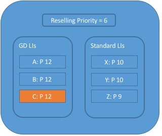
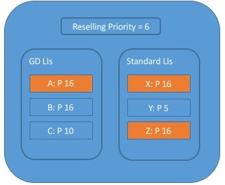
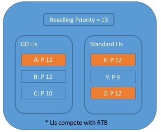
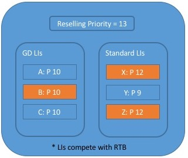
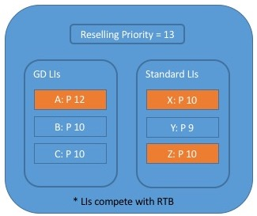

# Open Dynamic Allocation and Flexible Priorities

When working with your managed inventory, you often have eligible demand
from a number of different channels. You might have managed demand that
you have sold on a guaranteed or up-front basis, which you need to
ensure meets delivery commitments. You might also have managed demand
that your team is responsible for trafficking, but that may not have
committed up-front guarantees (performance demand, house campaigns,
etc.). And finally, you might have external demand sources that you work
with by exposing your inventory for reselling on the
Xandr exchange.

Through Open Dynamic Allocation, Microsoft Monetize
allows you to optimize across these different demand channels:
maximizing revenue for your managed inventory while still ensuring
delivery in full for your guaranteed/high-priority managed demand.

In this document, we explain the controls you have at your disposal to
configure Open Dynamic Allocation so you can tune, to your preference,
how the system decisions between maximizing revenue and mitigating risk
to delivery. We also explain in detail how flexible line item priorities
affect how these different demand sources are allowed to compete.

Flexible Priorities Provide Control for Managing Demand

You can set priority on both standard and guaranteed delivery line items
to any value from 1 through 20.

Historically, standard line items have been restricted to lower priority
settings than guaranteed delivery line items. This ensured that eligible
guaranteed line items would always deliver before standard line items.
In most cases this is the desired behavior: we need guaranteed line
items to always deliver in full, so prioritizing them above standard
line items is one logical way of making that happen. However, there are
cases where, due to various customer commitments, it is important that
standard line items be prioritized at or even above line items with
guaranteed delivery goals.

For more information on setting priorities, see
<a href="create-a-standard-line-item.md" class="xref">Create a
Standard Line Item</a> and
<a href="create-a-guaranteed-delivery-line-item.md"
class="xref">Create a Guaranteed Delivery Line Item</a>.

The Impact of Flexible Priorities on Open Dynamic Allocation

The ability to set line items of any type to any priority (1-20) changes
the dynamics of bid submissions. There are three factors relating to
priority that determine how demand will compete:

- **Reselling priority**: This is a value that is set at the Network
  (member) level. Reselling priority governs when inventory is available
  for resale to RTB demand. When a line item from a managed advertiser
  has a priority value *at or above* reselling priority and is eligible
  for an impression, then the impression is not available to RTB buyers.
  (See <a href="managing-your-inventory-reselling-exposure.md"
  class="xref">Managing Your Inventory Reselling Exposure</a> for more
  information.) This value also impacts guaranteed line items. The
  system will identify the highest priority guaranteed bid and highest
  priority standard bid. If the highest of these two priorities is:
  - *below* the reselling priority, then we allow both the guaranteed
    demand from the highest guaranteed priority tier and the standard
    demand from the highest standard priority tier to compete in the
    auction.
  - *at or above* the reselling priority, then we allow only demand from
    that higher tier to compete in the auction.
- **Standard line item priority**: The priority assigned to the standard
  line item. The default value is 5.
- **Guaranteed delivery line item priority**: The priority assigned to
  the guaranteed delivery line item. The default value is 14 for
  "Impressions" and 19 for "Exclusive".

The following scenarios illustrate how the three settings above interact
to determine how demand is allowed to compete in the auction.

Example Scenarios Demonstrating Flexible Priorities

These scenarios assume targeting is met for all line items in question.
Other settings, such as targeting, also impact which line items are
submitted.

<b>Note:</b> Under all these scenarios, if
there is an eligible guaranteed delivery line item with:

- a delivery type of **Exclusive** *and*
- a priority greater than or equal to all other line items

that line item will be the only one selected and will win the
impression.

**Scenario 1**

In this first scenario, we have three guaranteed delivery line items,
all with priority set at 12. We also have three standard line items: two
with priority 10, one with priority 9. All of these line items have
priorities above the reselling priority of 6, so they will not compete
against RTB demand. Instead, the highest priority line items from each
tier (guaranteed and standard) will be determined. The line item with
the highest priority will be sent to auction. If a guaranteed delivery
line item has the highest priority, only one line item will be sent.
(This is the case even if there are multiple guaranteed line items with
that same priority. See
<a href="guaranteed-delivery-auction-mechanics.md"
class="xref">Guaranteed Delivery Auction Mechanics</a> for details on
how the guaranteed delivery line item is selected.) If a standard line
item has a higher priority than the highest priority guaranteed line
item, only the standard line item will be sent to auction. (If multiple
standard line items have the same, highest, priority, all of them will
be sent to auction.)

In this scenario, one of the priority 12 guaranteed delivery line items
will be sent, because it's set to a higher priority than any of the
standard line items.

**Scenario 2**

In this scenario we have three guaranteed delivery line items, two with
a priority of 16, one with priority 10. We also have three standard line
items: two at priority 16, one at priority 5. We determine the highest
priority from each tier; in this case that's priority 16 for both
guaranteed and standard line items. As in Scenario 1, the highest line
item priority (16) is higher than the reselling priority (6), so we
don't compete against RTB. Unlike the first scenario, we have standard
line items that are at the same priority as the highest guaranteed line
item. So for guaranteed delivery, we select one of the line items at
priority 16. We also select both priority 16 standard line items, and
send all three to compete in the auction.

**Scenario 3**

In this final scenario, the reselling priority is higher than the
highest line item priority. When that happens, all line items compete
against RTB. In addition, we always send one guaranteed delivery line
item with the highest priority in that tier, as well as all standard
line items with the highest priority among the standard line items. The
following examples demonstrate different possibilities in this scenario:

*Example 1:* One guaranteed delivery line item at priority 12 and all
priority 12 standard line items are submitted to auction to compete with
RTB.

*Example 2:* One guaranteed delivery line item at priority 10 and all
priority 12 standard line items are submitted to auction to compete with
RTB.

*Example 3:* One guaranteed delivery line item at priority 12 and all
priority 10 standard line items are submitted to auction to compete with
RTB.

Implementation Recommendations

**Reselling priority:** We recommend that you set **Reselling priority**
1 tier *higher* than your lowest priority tier used for guaranteed
demand.

**Guaranteed Line Item Priorities**: The lowest priority tier you decide
to use for guaranteed demand will be allowing guaranteed demand to
compete with other demand channels, which gives the system the best
ability to maximize your revenue. Because of this, you should aim to
have as much of your guaranteed demand set up at this tier as possible.
Priorities at and above reselling priority can then be used to exempt
certain guaranteed line items from competition. Examples for why you
would want to exempt demand from competition (which risks lower overall
revenue to protect delivery) include:

- A line item is part of an insertion order for a sensitive client
  relationship, and it's worth the impact to overall revenue to ensure
  the line item meets its goals.
- You know inventory availability is scarce for a line item, so you
  prioritize it *at or above* reselling priority to give it the best
  chance of delivering in full.

**Standard Line Item Priorities:** Standard line items are generally
prioritized below guaranteed line items. Avoid spreading standard line
items across many priority tiers, as this adversely affects yield.
Similar to how most guaranteed demand is set up on a single tier, so
should most standard lines be set up on a single priority tier. Example
for why you would want to prioritize certain standard line items over
others include:

- You want to ensure that important performance demand is given
  preference over mediated demand.
- You want to traffic house ads at a lower priority, as it is difficult
  to determine a CPM value for these line items.

<b>Note:</b> The mechanics behind guaranteed
delivery continue to work to help ensure that you reach your delivery
goals, even when competing against standard line items. See
<a href="guaranteed-delivery-auction-mechanics.md"
class="xref">Guaranteed Delivery Auction Mechanics</a> for more
information.

Related Topics

- <a href="guaranteed-delivery.md" class="xref">Guaranteed Delivery</a>
- <a href="guaranteed-delivery-auction-mechanics.md"
  class="xref">Guaranteed Delivery Auction Mechanics</a>
- <a href="create-a-guaranteed-delivery-line-item.md"
  class="xref">Create a Guaranteed Delivery Line Item</a>
- <a
  href="xandr-api/member-service.md"
  class="xref" target="_blank">Member Service</a>

