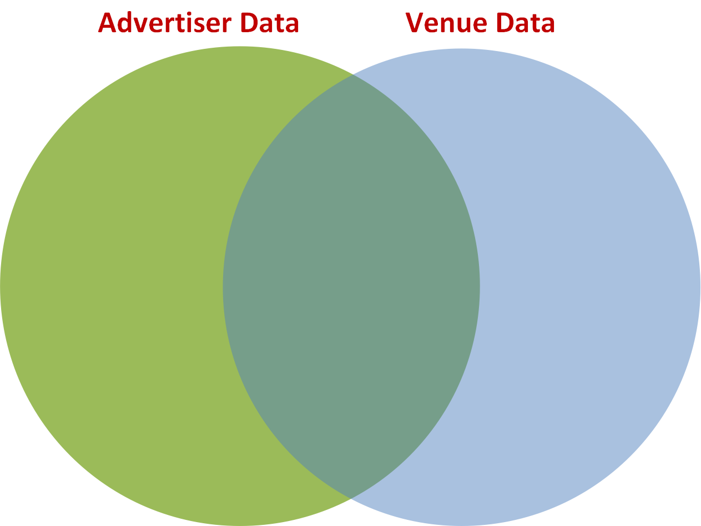
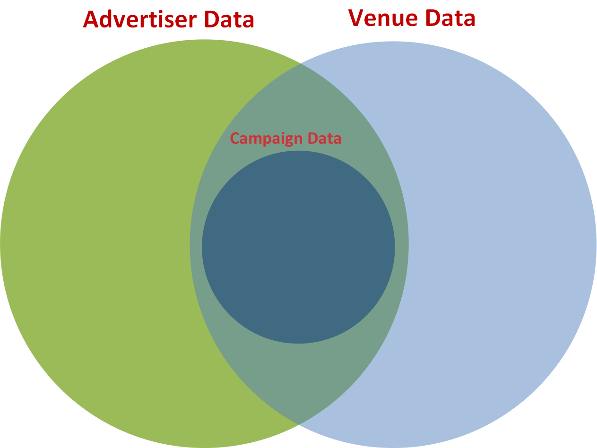
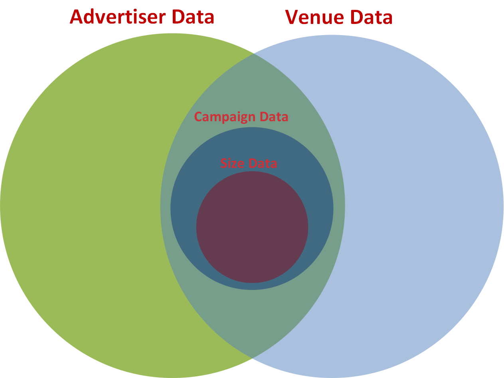
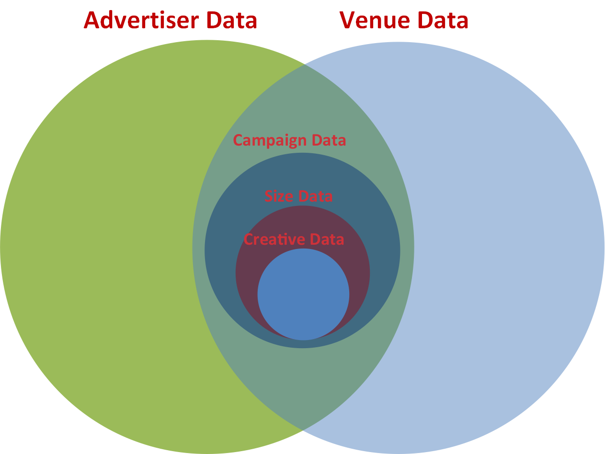

# Targeted Learn

<b>Important:</b> This guide only applies to
the legacy line item. If you are using the augmented line item (ALI),
see
<a href="optimization-guide-ali.md" class="xref">Optimization Guide -
ALI</a>.

The Xandr optimization engine uses a campaign's
past performance data (conversion rate and click-through rate) to
determine the appropriate bid for every impression relative to the
campaign's cost-per-acquisition (CPA) or cost-per-click (CPC) goal. When
you add a new campaign to Microsoft Monetize,
however, performance data is not yet available. In this case, the
Xandr optimization engine must first learn what
to bid for the campaign. This page describes the learn process.

Overview

When a campaign starts, no performance data is yet available. The
Version 7 optimization engine uses historical data to make an educated
guess for success rate and then calculates a learn bid accordingly. As
the campaign wins impressions, the algorithm takes new data into
account, causing learn bids to increase on well performing venues
(slices of inventory) and to decrease on poorly performing venues. In
summary, by leveraging broader historical data, our new Targeted Learn
algorithm makes learn bids more accurate faster and causes you to spend
more efficiently while learning.

<b>Note:</b> You have the ability to control
certain areas of the learn process with the
<a href="optimization-levers.md" class="xref">Optimization Levers</a>,
including the ability to override the learn bid amounts.

<b>Tip:</b> To
<a href="shorten-the-targeted-learn-phase-using-bid-type-reports.md"
class="xref">Shorten the Targeted Learn Phase Using Bid Type Reports</a>
for a campaign with a tight budget or timeline, use the Bid Type report
for inventory exclusion.

How Targeted Learn Leverages Historical Data

The Targeted Learn algorithm leverages historical data from multiple
levels, moving from less granular to more granular data as the campaign
gets more success events. The order in which we leverage historical data
is known as the Bayes Funnel, named as such due to its use of
<a href="http://en.wikipedia.org/wiki/Bayes%27_theorem" class="xref"
target="_blank">Bayes' theorem</a>, a mathematical formula for
calculating probability based on known conditions.

- advertiser
- advertiser, venue
- advertiser, venue, campaign,
- advertiser, venue, campaign, creative size
- advertiser, venue, campaign, creative size, creative

Example

The most intuitive way to demonstrate how Targeted Learn leverages data
is through an example with Venn diagrams. Assume that you have just
created a new Pancakes campaign for the advertiser Bob's Diner. You had
a similar campaign running previously that used the same pixel, Pixel A.

Step 1. Leverage advertiser data

Once the advertiser Bob's Diner has at least 5 conversions (Pixel A
firing 5 times), we leverage all of the advertiser's data to calculate a
learn bid.

Step 2. Leverage advertiser and venue data

Since the advertiser has run this offer before, it may have even gotten
5 conversions on a single venue (Pixel A firing 5 times on a specific
venue for that advertiser). In this case, when calculating a learn bid
for this venue, our algorithm leverages the advertiser's data specific
to this venue. This data is represented by the intersection of the
advertiser and venue data.

Step 3. Leverage advertiser, venue, and campaign data

At some point, the Pancakes campaign will get 5 conversions on a
specific venue. In this case, when calculating a learn bid on this
venue, our algorithm leverages the campaign's data specific to that
venue. This data is represented by the intersection of the advertiser,
venue, and campaign data.

Step 4. Leverage advertiser, venue, campaign, and creative size data

Let's say the Pancake Campaign has 3 300 x 250 creatives. Eventually,
the 300 x 250 creatives will cumulatively get 5 conversions on a single
venue. At this point, when any of the 300 x 250 creatives are bidding on
a venue, our algorithm uses the 300 x 250 creative size data on that
venue to calculate a learn bid. This data is represented by the
intersection of the advertiser, venue, campaign, and size data.

Step 5. Leverage advertiser, venue, campaign, creative size, and
creative data

Finally, one of the Pancakes Campaign's creatives will receive 3 success
events on a venue. When that creative is bidding on this venue, our
algorithm leverages the creative's data specific to that venue to
calculate a learn bid. This data is represented by the intersection of
the the advertiser, venue, campaign, size, and creative data.

Step 6. Continue to learn

The Targeted Learn algorithm then leverages this level of data further
while the campaign continues learning. Once the campaign gets enough
events to exit the learn phase, it goes to the optimized phase as usual.

If an advertiser has no data

When a new campaign is started under an advertiser with no historical
data to leverage, the optimization engine determines the average bid on
each venue and use this data to start winning impressions. Once the
advertiser has 3 success events, the engine begins to leverage
historical information to calculate learn bids.

**Related Topics**

- <a href="optimization-buying-strategies.md" class="xref">Optimization
  Buying Strategies</a>
- <a href="what-is-an-optimization-node.md" class="xref">What is an
  Optimization Node?</a>
- <a href="learn-budget.md" class="xref">Learn Budget</a>
- <a href="what-is-valuation.md" class="xref">What is Valuation?</a>
- <a href="optimization-levers.md" class="xref">Optimization Levers</a>
- <a href="cadence-modifier-and-the-chaos-factor.md"
  class="xref">Cadence Modifier and the Chaos Factor</a>
- <a href="sell-side-optimization.md" class="xref">Sell-Side
  Optimization</a>
- <a href="dynamic-learn-percentage.md" class="xref">Dynamic Learn
  Percentage</a>
- <a href="give-up-price.md" class="xref">Give Up Price</a>

