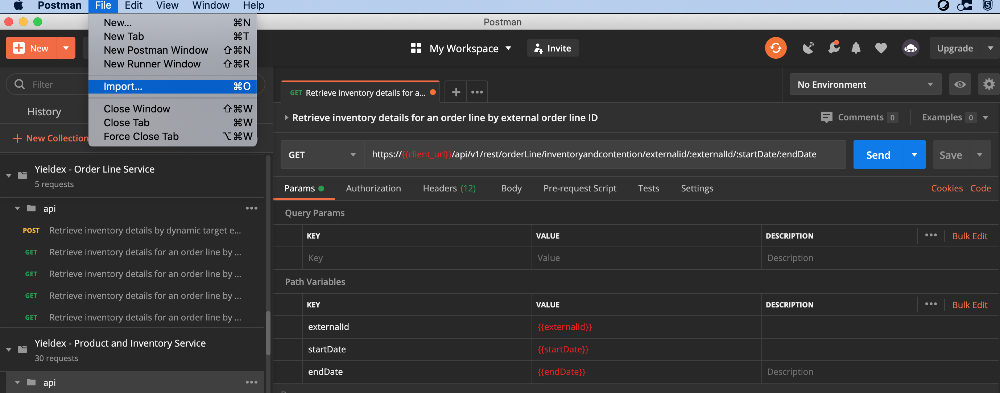
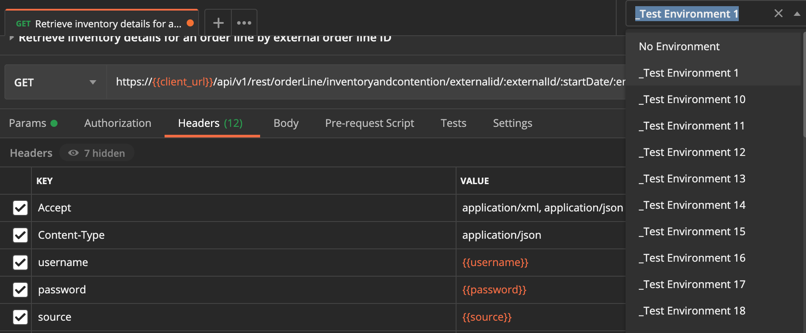
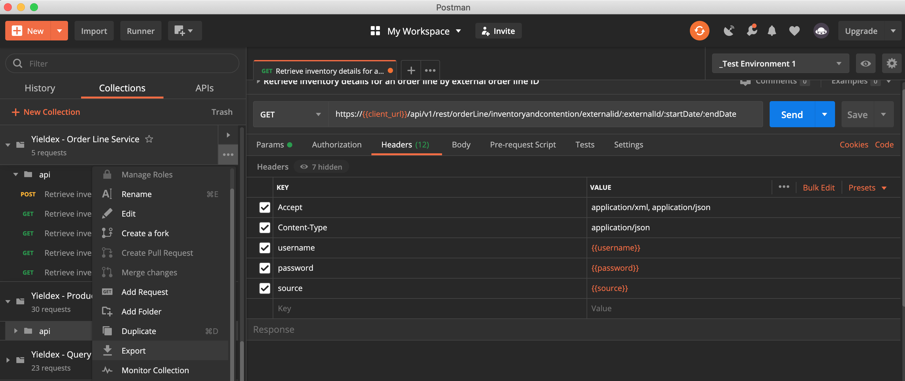
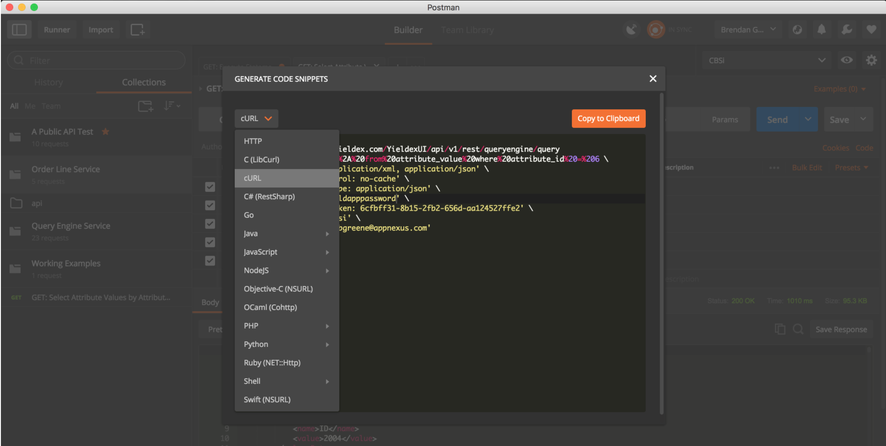

# Using Postman with the Yield Analytics API

How to use Postman with Yield Analytics APIs

## Overview

The goal of this tutorial is to take a new Postman install and walk away
with a template for every API call available in the public Yield
Analytics API. This will prove a basis by API calls can be tailored to
specific clients data without the need repeatedly build out the boiler
plate parameter of an API call. By the end of the tutorial you should
have a solid base for interacting with the API via:

- A Template for every API Call in the Yield Analytics Public API

- Environment variables to allow for abstracting template calls to fit
  any clients needs

- A working environment for a specific customer

- How to export and share a specific call you’re working on

- Basic understanding of converting http calls into other formats such
  as curl

## Swagger Templates for Yield Analytics API Services

- <a
  href="../attachments/yield-analytics-api/productresource-swagger.json"
  class="xref">Product and Inventory Service Template</a>

- <a
  href="../attachments/yield-analytics-api/insertionorderresource-swagger.json"
  class="xref">Insertion Order Service Template</a>

- <a
  href="../attachments/yield-analytics-api/orderlineresource-swagger.json"
  class="xref">Order Line Service Template</a>

- <a
  href="../attachments/yield-analytics-api/queryengineresource-swagger.json"
  class="xref">Query Engine Service Template</a>

## Importing a Swagger Template into Postman

- Copy the Swagger Template URL by copying the address or clicking
  through and copying the url from the desired template listed above

- In Postman select: file → import

  

- Select Import From Link and paste in the Template URL

  

- Note that the headers have a standard key and a value wrapped in {{}}.
  Leave these in place and continue to the next section
 
  

## Setting Up a Postman Environment with Variables

- In Postman, text wrapped in {{}} will be treated as a variable.
  Variables are symbols that can take different values. You might be
  familiar with variables from other languages from your prior
  programming experience. Variables in Postman work the same way.

- Postman also supports the concept of an environment. This is
  essentially a collection of variables that translate to a working
  group for the desired client you want to interact with.

- The following image shows several variables: {{client_url}},
  {{accepts}}, {{username}}, {{password}} and {{source}}

 
  

- In order to setup an environment click the gear icon located above the
  current active API call and select Manage Environments.
 
  

- Next click on the add button, name your environment and add in the
  variable names with values as shown in the following image
 
  

- Finally select your new environment from the environment dropdown
 

- When your API call is invoked the variables in {{}} will be replaced
  by the value you’ve assigned to the variable at runtime.

<b>Note:</b> The templates are meant to speed
the development of API calls and very likely not work until the url and
body parameters have been tweaked using data applicable to the client.

## Exporting an API Call from Postman

- Postman provides multiple mechanisms for sharing work. Exporting
  provides a quick and easy way to share an API call that you’re working
  on. The process will download a .json file that includes all the
  parameters you’ve added to the call. This .json file can then be
  imported by another user using the import process described before.
  The only difference being you would import from a file rather than a
  link.

  

  

  <b>Note:</b> You’ll need to clear out your
  password before exporting

  

  

- The main goals here are knowledge sharing and providing engineering
  with an runnable example that we can use to quickly determine if the
  call is incorrect or if the server action is incorrect.
 
 

## Converting an http Call to a Curl Command

Postman provides a quick and easy way to convert these HTTPS API calls
into other formats. Simply click on the "Code" link on the right hand
side of your active API call and then select the conversion you want as
depicted in the following image:

